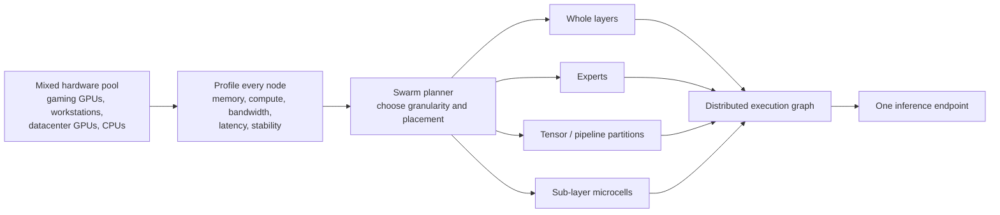
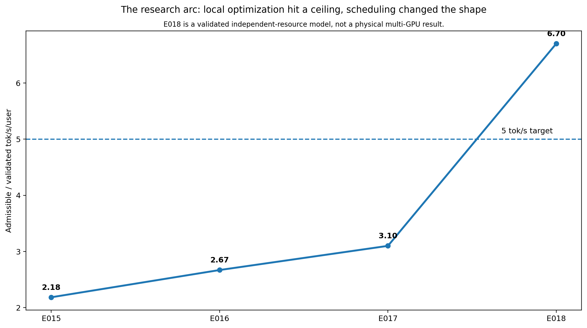
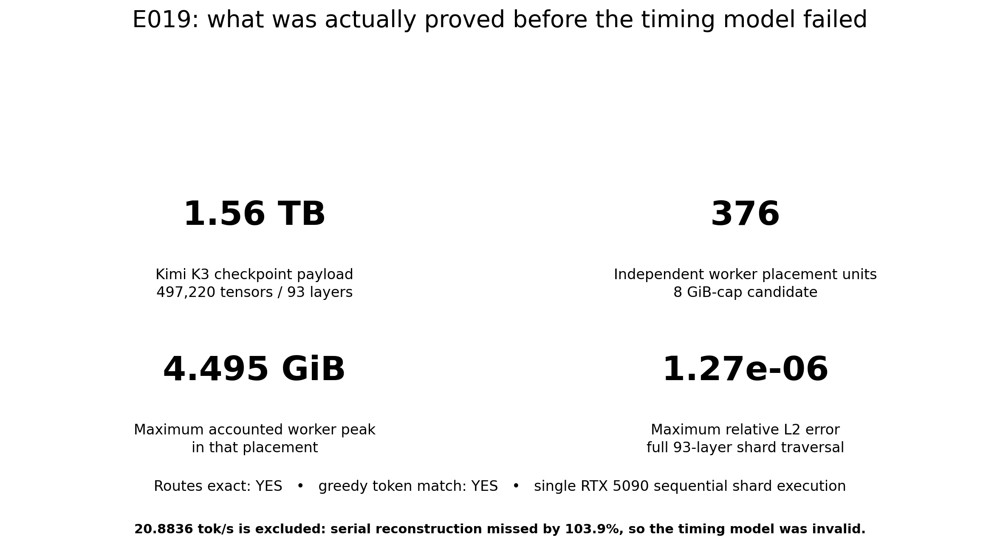
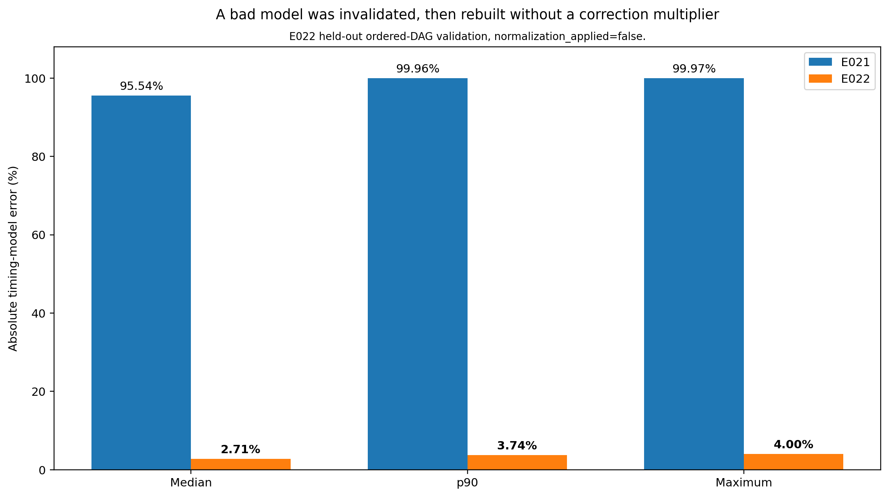
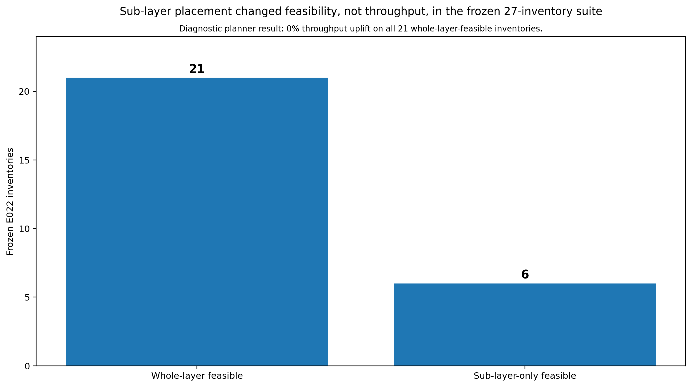

# Swarm Inference

### One enormous model. Thousands of mismatched machines. One inference system.

Large AI models increasingly assume access to large, tightly connected GPU servers. That works when you can buy or rent the right cluster.

The rest of the world's compute looks very different.

It is fragmented across gaming GPUs, workstations, older datacenter cards, laptops, mixed GPU generations, machines with different amounts of memory, and networks ranging from NVLink to ordinary Ethernet and the public internet. Much of that hardware is difficult to combine efficiently for one large model.

**Swarm Inference is an attempt to change that.**

The overall goal is to build an inference system that can take an arbitrary pool of heterogeneous machines, understand what each machine is good at, split a model only as finely as necessary, and make the pool behave like a useful shared inference fabric.

If this works, the size of a model no longer has to be dictated by the memory of one GPU or one server. A machine with only a few gigabytes available could still contribute useful work to a model measured in terabytes, while larger and faster machines take larger pieces of the graph.

The system should choose the right execution strategy automatically. Sometimes that means whole layers. Sometimes experts. Sometimes tensor or pipeline parallelism. Sometimes a layer itself has to be split into smaller pieces. Slow network links should carry fewer boundaries. Fast local links can support finer decomposition. **Useful model throughput is the objective. Worker count is simply one variable the planner can use.**

## The north-star experiment

The current stress test is **Kimi K3**, a 93-layer mixture-of-experts model with 896 routed experts and roughly **1.56 TB of declared checkpoint payload**.

Kimi K3 is deliberately difficult. It is far larger than a consumer GPU, and even a single routed layer is large enough to make ordinary layer-per-worker designs awkward on small devices.

The long-term north star for Swarm is:

> **Serve a frontier-scale open model such as Kimi K3 at interactive speed by pooling heterogeneous commodity hardware, including workers too small to hold a whole model layer.**

The current performance target is **at least 20 output tokens per second per user** on the Kimi K3 benchmark, while preserving numerical correctness and keeping the architecture capable of scaling to large heterogeneous pools.

That target has **not** been reached. This repository shows the strongest evidence so far, including the experiments that failed and the performance models that were invalidated.

Experiment 026 uses the smaller Qwen3.8-27B target to test the distributed runtime on physical WAN hardware. It is an important systems proof, but it does not satisfy the Kimi K3 north star or the 20 tok/s/user target.

## What Swarm is trying to build



A **microcell** is a logical piece of model computation. Physical placement is decided separately. Many microcells can be fused onto one worker, while a difficult component can be split across several workers when the hardware requires it. The planner decides where physical boundaries should exist based on memory, compute and network topology.

That separation between logical decomposition and physical placement is central to the project. It allows Swarm to minimize expensive network boundaries while still using hardware that conventional model partitions cannot easily accommodate.

---

# What Experiments 016–022 and 026 found

This repository contains public evidence for the seven consecutive Experiments 016–022 and the later physical-WAN Experiment 026. Together they changed the direction of the project.

Experiments 023–025 are not included in this public evidence package, so this repository makes no claims about them.

The short version is:

1. **Local kernel optimisation hit a wall.**
2. **Changing the execution schedule produced a much larger gain.**
3. **Kimi K3 could be decomposed into pieces small enough for consumer-scale workers.**
4. **The first performance model for that fine-grained design was badly wrong, and was rejected.**
5. **The rebuilt model reduced median prediction error from 95.5% to 2.7%.**
6. **Fine-grained splitting currently looks more valuable for unlocking otherwise unusable hardware than for making already-feasible placements faster.**
7. **A real three-machine WAN run exposed serial synchronization and transport reliability as the next blocking primitives.**



## 1. Scheduling mattered more than another round of kernel tuning

Experiments 016 and 017 kept pushing the existing execution path harder.

They improved the retained exact path from **2.18 tok/s/user** to **2.67**, then **3.10 tok/s/user**. Useful progress, but still short of the experiment target.

Experiment 018 changed the architecture instead.

A coarse **wavefront schedule** allowed independent parts of the model to make progress concurrently, while an immutable AttnRes cache avoided repeatedly moving the same state across boundaries.

The result was:

- **6.702 tok/s/user**
- **2.16x** the corresponding serial schedule
- **83.8% pipeline efficiency**

This is the strongest validated performance result in this experiment series.

It is a **validated independent-resource model grounded in physical Kimi K3 measurements and shaped network assumptions**. It is not presented as a physical 12-GPU or multi-machine run.

The important lesson was larger than the number itself: **the structure of the distributed execution graph mattered more than squeezing another few percent from one local operation.**

## 2. A 1.56 TB checkpoint was decomposed below 4.5 GiB per worker

Experiment 019 asked a harder question.

Could the full Kimi K3 execution graph be represented without forcing any worker to own a complete ordinary layer, routed expert or shared expert?

The answer was yes.

The 8 GiB-cap candidate produced:

- **376 independent worker placement units**
- **4.495 GiB maximum accounted peak ownership**
- no worker owning a whole ordinary layer or expert
- a complete **93-layer shard traversal** on the reference machine
- **1.27e-6 maximum relative L2 error**
- exact expert routes
- matching greedy output token



This matters because it attacks one of the core constraints behind Swarm directly.

A model with roughly **1.56 TB of checkpoint payload** was expressed as execution units with a maximum accounted footprint below **4.5 GiB**.

The result establishes something narrow and useful: **whole-layer memory is not a fundamental requirement of the execution representation.** Efficient execution across hundreds of physical internet-connected machines remains an open experiment.

The experiment also produced a 20.8836 tok/s/user timing projection. Its validation failed badly, so it remains diagnostic only. That failure led directly to Experiments 021 and 022.

## 3. The project caught its own performance model being wrong

This is one of the most important results in the repository.

The fine-grained architecture looked extremely promising on paper. Experiment 021 replayed the ordered shard execution against physical service measurements to test whether the model actually predicted reality.

It did not.

The median timing-model error was:

**95.54%**

At that point the large throughput projections from the invalid model were rejected.

Experiment 022 rebuilt the resident-service model and deterministic event accounting from the physical execution path. On held-out ordered-DAG cases, error fell to:

- **2.71% median**
- **3.74% p90**
- **4.00% maximum**
- **no global correction multiplier**
- `normalization_applied=false`



For a project trying to predict the behaviour of hardware it has not physically assembled yet, this matters enormously. Swarm needs a planner that can make trustworthy decisions before allocating a fleet. A fast simulator with the wrong physics is worse than a slow one.

## 4. Fine-grained splitting may be a capacity weapon before it is a speed weapon

Experiment 022 froze **27 heterogeneous hardware inventories** and compared two planning strategies against exactly the same resources:

- a strong whole-layer planner
- an adaptive planner allowed to use sub-layer placement

The diagnostic result was revealing.

In **6 of the 27 inventories**, the whole-layer planner could not find a feasible placement while the adaptive planner could.

In the **21 inventories where whole-layer placement already fit**, the measured diagnostic throughput uplift from sub-layer placement was **0%**.



That changes the working hypothesis.

The strongest observed value of sub-layer execution so far is **capacity unlock**: using hardware that would otherwise be stranded because the natural model component is too large for the available memory. A speed advantage on already-feasible coarse placements has not appeared yet.

This result remains diagnostic because two Experiment 022 gates are still open: production-native primitive bindings and representative full-93-layer placement replay. The final E022 verdict is therefore `MODEL_INVALID`, not a declared planner win.

## 5. Physical WAN execution worked, but practical WAN serving did not

Experiment 026 moved from shaped links and modeled independent resources to a physical three-machine topology: a local RTX 5090 coordinated an RTX 3080 Ti in Japan and an RTX 3060 in South Korea over genuine WAN links.

Qwen3.8-27B Q4_K_M was split into contiguous stages and executed across all three machines. Short target-only runs matched the local greedy stream, disk-warm verification of the same exact shard was **103.19x** faster than fully uncached acquisition, and a controlled production-stage kill recovered in **9.508 seconds** without prompt replay, token loss, or duplication.

The integrated result was still decisively negative:

- the best exact WAN development run reached **1.615 committed tok/s**, versus the experiment's **8 tok/s** interactive gate
- the sealed run reached **0.590 tok/s**, diverged from the local greedy stream at zero-based token **178**, and ended on a transport reset after **282 of 512** requested tokens
- native MTP reached 2.667 committed tokens per target traversal on one WAN prompt, but diverged on four of six development prompts and was rejected
- response wait consumed **95–98%** of the measured token cycle while the two remote stages together needed only about **11 ms** of median compute in the sealed run

This is the first physical heterogeneous swarm evidence in the public series, but not a viable serving result. The verdict is [`WAN_SWARM_NOT_VIABLE_UNDER_TESTED_CONDITIONS`](experiments/026/).

---

# Why this could matter

Modern inference stacks are very good when the hardware pool looks the way they expect it to look: large accelerators, known interconnects, regular clusters and model partitions that fit cleanly onto those devices.

Swarm is exploring the uglier case.

A future pool might contain:

- one fast 80 GB accelerator
- several 24 GB gaming GPUs
- older 16 GB cards
- machines separated by different network links
- devices that can store a few experts but not a whole layer
- capacity appearing and disappearing over time

A useful Swarm planner should be able to look at that pool and answer:

**What is the best inference system I can build from exactly these resources?**

That requires more than model sharding. It requires a continuously calibrated understanding of compute, memory, communication, state placement, concurrency and the model's execution graph.

The ambition is eventually to make adding another imperfect machine to the pool useful in the same way that adding another homogeneous GPU to a conventional cluster is useful today.

That is the research programme.

---

# The research arc

| Experiment | Plain-English question | Verdict | What changed |
|---|---|---|---|
| [016](experiments/016/) | Can better exact batching break the existing bottleneck? | `FAIL` | 2.669 tok/s/user. Helpful, but the architecture still hit a ceiling. |
| [017](experiments/017/) | Can optimising the heaviest local critical path close the gap? | `FAIL` | Best exact result 3.099 tok/s/user. Local optimisation alone was not enough. |
| [018](experiments/018/) | What happens if independent work moves concurrently instead of serially? | `PASS_STRONG` | Wavefront execution reached 6.702 tok/s/user in the validated independent-resource model. |
| [019](experiments/019/) | Can Kimi K3 be split into genuinely small worker footprints? | `MODEL_INVALID` | 376 placement units, 4.495 GiB max peak, full 93-layer correctness passed. Performance model failed validation. |
| [020](experiments/020/) | Is the architecture ready to justify renting a physical fleet? | `NOT_READY` | A 96-worker deployment was designed, then correctly stopped before spend because the projection gate failed. |
| [021](experiments/021/) | Does the simulator actually predict ordered physical shard execution? | `MODEL_INVALID` | No. Median error was 95.54%. The throughput model was invalidated. |
| [022](experiments/022/) | After repairing the model, when does sub-layer placement actually help? | `MODEL_INVALID` | Timing error fell to 2.71% median. Six diagnostic capacity unlocks appeared, with zero throughput uplift where whole-layer placement already fit. Two production gates remain open. |
| [026](experiments/026/) | Does the integrated system make a 27B model practical across three heterogeneous machines on the real WAN? | `WAN_SWARM_NOT_VIABLE_UNDER_TESTED_CONDITIONS` | Physical distribution, exact shard caching, and controlled failover worked; throughput, sealed correctness, completion, and transport reliability did not. |

The failures are part of the evidence. Each one removed an attractive explanation that did not survive measurement.

---

# What has been proved, and what has not

## Supported by the evidence in this repository

- Real Kimi K3 CUDA execution has been measured on an RTX 5090.
- The E018 wavefront architecture reached **6.702 tok/s/user** in a validated independent-resource performance model grounded in physical service measurements.
- The full Kimi K3 graph can be decomposed into sub-layer placement units with a maximum accounted footprint below **4.5 GiB** in the E019 8 GiB-cap candidate.
- A sequential full-93-layer sharded traversal passed numerical correctness checks.
- The original fine-grained timing model failed validation at **95.54% median error** and was rejected.
- The rebuilt E022 ordered-DAG model reached **2.71% median held-out error** without a global normalization multiplier.
- Qwen3.8-27B Q4_K_M physically executed across three heterogeneous machines on measured, unshaped WAN links in E026.
- E026 short target-only WAN runs reproduced the local greedy stream, and its exact same-shard disk-warm cache check measured a **103.19x** speedup over fully uncached acquisition.
- E026's controlled warm-replica stage kill recovered in **9.508 seconds** with an exact 64-token control match and no prompt replay, lost tokens, or duplicate tokens.

## Still to be proved

- Physical Kimi K3 execution across a real heterogeneous multi-machine swarm.
- The 20 tok/s/user north-star target.
- A completed, strictly identical 512-token physical WAN run at E026's 8 tok/s interactive gate.
- An exact, reconnectable multi-token verification protocol that removes per-token WAN round trips.
- Production-native execution for every required sub-layer primitive.
- A repeatable performance advantage from sub-layer placement when coarse placement already fits.
- Reliable LAN and WAN behaviour at larger scale.
- Multi-user goodput, failure recovery and economics under sustained load.

These are the next gates. The public claims stop where the evidence stops.

For exact wording and evidence status, see the [claim ledger](docs/CLAIMS.md).

---

# Evidence methodology

The experiments mix real execution with performance modeling, so every public result is classified by evidence type.

| Evidence class | Meaning |
|---|---|
| **Physical local** | Real model weights and CUDA execution measured on the local RTX 5090. |
| **Validated independent-resource model** | Service inputs are physically measured, independently resident resources are modeled, and the declared model-validation gate passed. |
| **Shaped network** | RTT and bandwidth behaviour comes from an explicit network model rather than a physical WAN or LAN. |
| **Diagnostic / model invalid** | Preserved because it explains the research path, but not admitted as a performance result. |
| **Physical heterogeneous swarm** | Multiple independent physical machines execute the distributed graph. E026 reaches this class for Qwen3.8-27B on three machines, with a negative viability verdict. Experiments 016–022 do not reach it. |

See [METHODOLOGY.md](docs/METHODOLOGY.md) for the complete methodology.

# Audit the claims yourself

This is intended to be an evidence repository, not a gallery of benchmark screenshots.

The bundle includes aggregate receipts, calibration tables, validation outputs, correctness receipts, failure logs, charts and representative raw service evidence behind the public numbers.

Run:

```bash
python scripts/verify_headlines.py
python scripts/verify_checksums.py
```

To regenerate the synthesis figures:

```bash
python -m pip install -r requirements.txt
python scripts/regenerate_figures.py
```

Very large duplicate traces, generated placement payloads, temporary directories and repeated inventory copies were intentionally removed from the Git-friendly package. Every member of the original 3.2 GB expanded Experiments 016–022 archive is still indexed by path, uncompressed size and ZIP CRC32 in [`provenance/source-archive-members.csv`](provenance/source-archive-members.csv).

For E026, the 71-row canonical dataset, compact proof receipts, focused state/network/cost evidence, and complete 31-file final remote collection are retained. All 831 supplied source artifacts are indexed by path, byte size, and SHA-256 in [`provenance/experiment-026-source-files.csv`](provenance/experiment-026-source-files.csv); the public transformations are recorded in [`experiments/026/evidence/source-manifest.json`](experiments/026/evidence/source-manifest.json).

The Kimi K3 checkpoint is not redistributed. Re-running physical benchmarks from scratch requires the model, compatible hardware and the companion runtime source tree from the corresponding experiment revision.

# Repository layout

```text
experiments/016..022,026/
  README.md             accessible experiment summary
  REPORT.md             full technical report
  evidence/             curated measurements, receipts, validation and charts

data/                   cross-experiment tables
figures/                synthesis figures used in this README
scripts/                headline verification, checksums and figure regeneration
docs/                   claims, methodology, limitations and sanitization notes
provenance/              source archive hashes and complete member inventory
```

# Where the project goes next

The immediate research priority is to turn E026's physical distribution proof into an exact, reconnectable protocol that does not pay a serial WAN round trip for every token.

That means:

1. build exact, state-local multi-token verification with reconnectable transport
2. complete a sealed 512-token three-machine run with identical greedy output and at least 8 committed tok/s
3. remove the serial per-token RPC dependency exposed by the E026 wait decomposition
4. close E022's native-primitive and representative full-93 Kimi K3 gates
5. measure multi-request goodput and sustained recovery economics, not only isolated-user latency
6. increase physical scale only after the previous topology completes correctly and repeatably

The end goal remains simple to state, even if it is difficult to achieve:

> **Make enormous open models run usefully on compute pools that were never designed to behave like one machine.**

# License

Apache-2.0. Research artifacts retain the same license as the source project unless a third-party artifact states otherwise.
