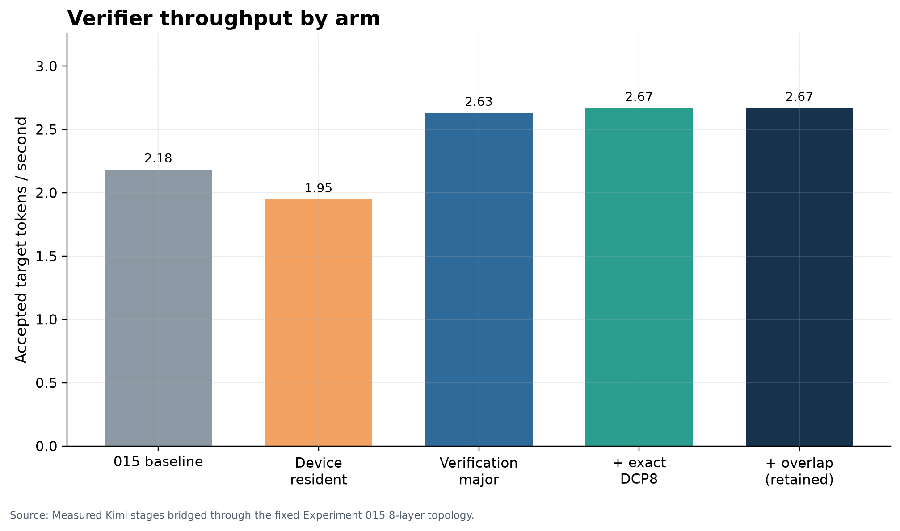
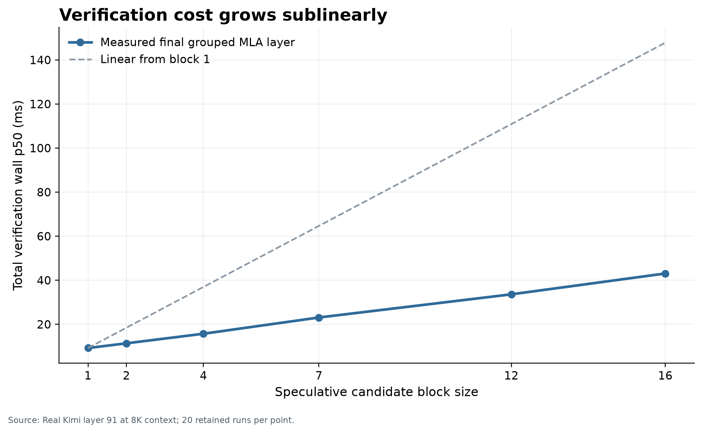
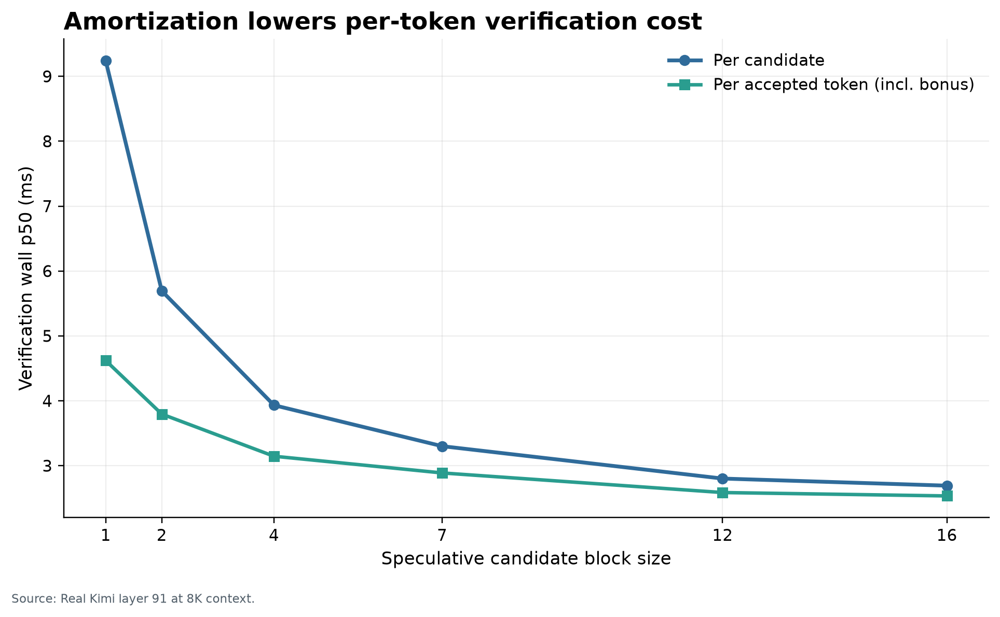
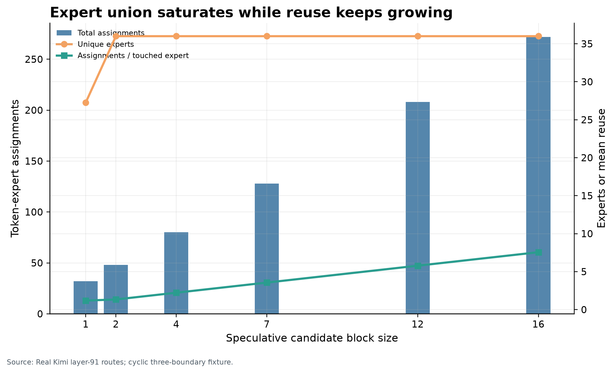
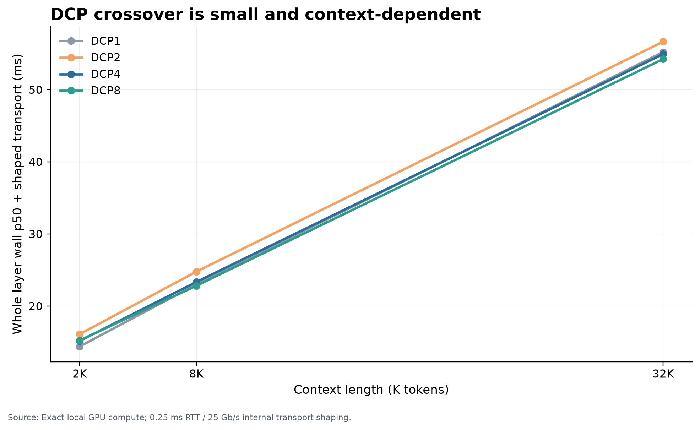
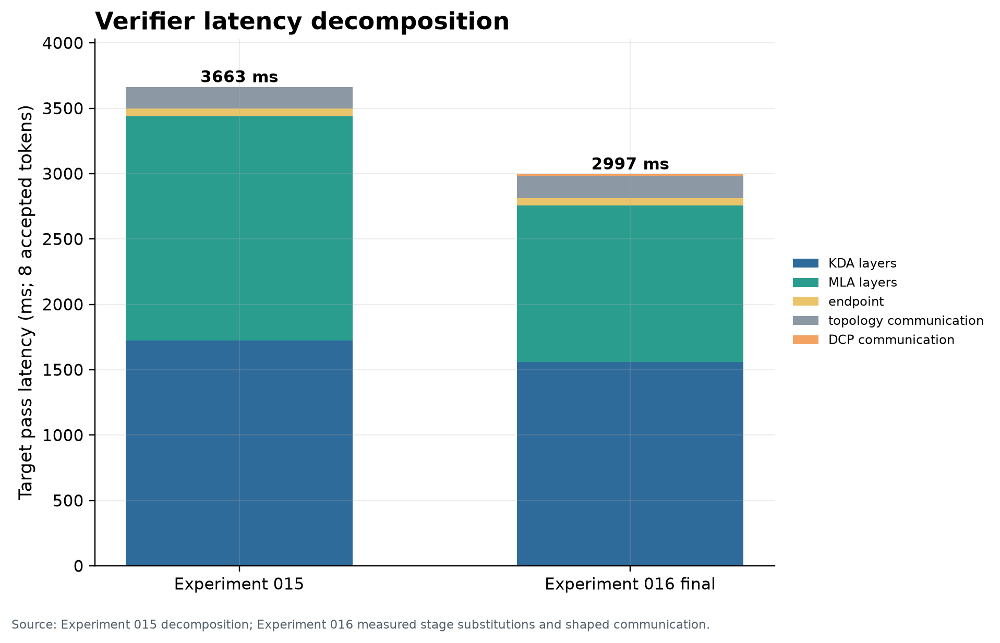
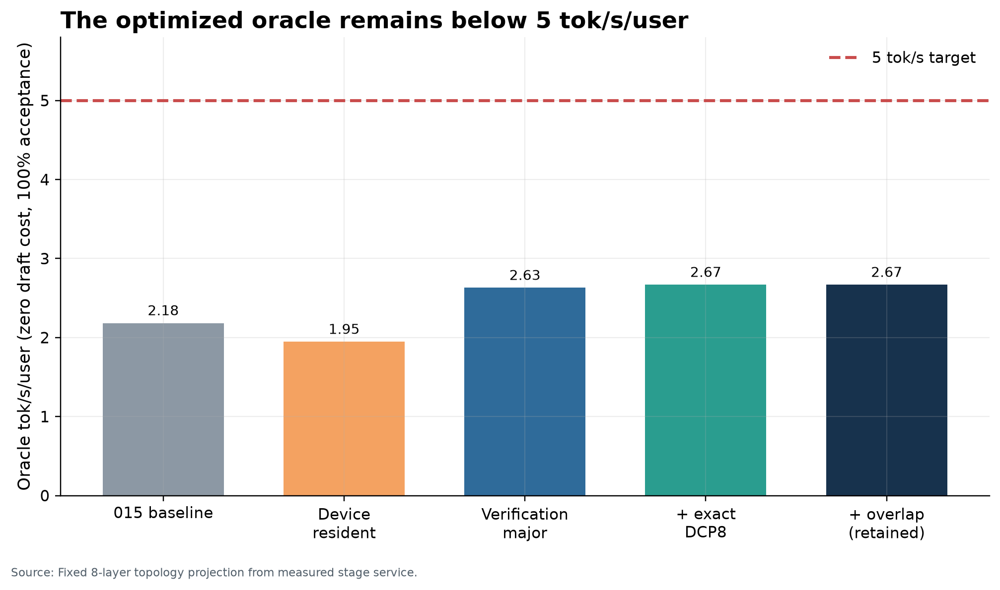

# Executive result

**FAIL.** Exact verification-major scheduling produced large representative-layer gains, but the conservative fixed-topology verifier bridge improved only **1.222×**, from **3663.31 ms** to **2997.24 ms** per eight accepted tokens. That is **374.65 ms per accepted token** and an oracle ceiling of **2.6691 tok/s/user**, below 5.

Experiment 015's canonical oracle was **2.1838 tok/s/user**. The final verifier does not achieve the required 2.3× speedup and does not make 5 tok/s/user theoretically reachable. The largest gain came from grouping real routes across the verification block and launching all known MLA queries as one exact triangular batch. The largest remaining fixed-topology component is **KDA layers**. Changed CUDA paths passed exact-route/state checks and numerical tolerances; a new 93-layer greedy generation was not rerun.

The decision is robust to a favorable alternative bridge: applying the in-run serial-to-final ratios directly would yield **4.6158 tok/s/user**, still below 5. The conservative bridge is primary because the Experiment 015 oracle already used batch-8 component calibrations; applying the serial ratio would double-count amortization.

## 1. Hypothesis

The hypothesis was that candidate positions were known future work and could be made a first-class unit: exact routing across the block, expert-major grouping, device-resident gather/compute/scatter, exact triangular MLA, exact DCP, and safe overlap. The local half of this hypothesis is supported: block-16 layer service reached useful sublinear scaling and 2.36–2.83× speedups over serial target-row replay. The central whole-verifier hypothesis is rejected because those local gains do not translate to 2.3× against the already-batched Experiment 015 calibration.

The 015 numbers below are parsed, not copied from the prompt: `architecture-pareto/results.json`, `final-recommended-architecture.json`, `microwork/results.json`, `expert-routing/results.json`, and `dcp/results.json`.

- Best qualified Experiment 015 throughput: **1.1766258548 tok/s/user**.
- Impossible Experiment 015 oracle: **2.1838203221 tok/s/user**.
- Required improvement for 5 tok/s/user: **2.289566×**.
- Measured four-worker microwork efficiency: **78.8090%**.
- Route-predictor precision/recall: **17.0856% / 17.0856%**.
- Experiment 015 shaped 8K DCP8 MLA-stage gain: **40.4683%**; it was not a whole-model result.
- Winning topology held fixed: **8-layer microcells**.

## 2. What was implemented

The canonical runtime now has an opt-in `verification-major` execution path with immutable verification-block and grouped-assignment objects; stable expert-major ordering; exact supported-size chunking; device-resident block input/output and intermediate buffers; batch routing; fused indexed gather/scatter; deterministic reduction; exact same-session KDA/MLA state progression; session-state cloning; and failure invalidation.

The native CUDA backend adds two reusable primitives. Indexed row-copy turns 128 logical gathers and 128 logical scatters at block 7 into two kernels. Exact triangular MLA appends the known cache rows first and evaluates all prefix-limited queries in one launch while retaining the serial kernel's softmax accumulation order. The final DCP path computes stable context-shard maxima, denominators, and latent numerators on device, combines them deterministically, and performs the unchanged Kimi value projection. Legacy DLLs fall back or fail closed for explicitly requested DCP.

No router approximation, expert dropping, model change, lossy KV, activation compression, or draft-model work was used.

## 3. Experimental setup

- Host: Windows 11-class build `Windows-10-10.0.26200-SP0`, one RTX 5090 32 GB, driver/CUDA details preserved in `environment.json`.
- Target: local `<local-kimi-k3-checkpoint>`; architecture/config metadata and checkpoint hashes are in `model-metadata.json`.
- Physical execution: real CUDA layer 89 (KDA) and layer 91 (Gated MLA), real Kimi weights, all 896 experts resident for the active layer.
- Contexts: short-context block sweep plus exact 8K sweep; exact local DCP at 2K, 8K, and 32K.
- Topology: the Experiment 015 8-layer microcell model, 12 cells, 81 internal and 11 coarse boundaries.
- Shaping: internal DCP uses 0.25 ms RTT, zero jitter, 25 Gb/s, zero loss. Existing topology shaping remains 0.25 ms/25 Gb/s internal and 5 ms/10 Gb/s coarse. No result is labeled physical WAN.
- Statistics: physical sweeps use medians after warm-up; retained counts are stored in each raw JSON. Inputs cycle three immutable real Kimi stage boundaries, an explicit representativeness limitation.
- Seeds: physical GPU runs use no RNG and replay a hashed immutable trace; the CPU DCP component seed is **1601601**. Exact details are in `run-seeds.json`.

The primary topology result is a validated-model bridge, not a physical 93-device measurement. It replaces the exact Experiment 015 KDA/MLA batch-8 calibration points with measured Experiment 016 device times, leaves endpoint/topology service unchanged, and adds shaped DCP transport.

## 4. Baseline reproduction

The genuine baseline is the preserved Experiment 015 block-7 target-only oracle: **3663.305044 ms**, **457.913130 ms/accepted token**, **2.1838203221 tok/s/user**. Its decomposition is KDA 1721.94 ms, MLA 1717.68 ms, endpoint 58.24 ms, and shaped topology communication 165.45 ms.

Arm A's local serial-row replay is also preserved in raw results for within-run comparisons, but it is not substituted for the canonical baseline. This prevents a favorable reconstruction from overwriting Experiment 015's actual batch-8 model inputs.

## 5. Arm-by-arm results

| Arm | Target pass (ms) | ms / accepted token | Oracle tok/s/user | Speedup vs 015 | Admission |
| --- | --- | --- | --- | --- | --- |
| A: Experiment 015 baseline | 3663.31 | 457.91 | 2.1838 | 1.000× | retained |
| B: device-resident token-major | 4107.59 | 513.45 | 1.9476 | 0.892× | rejected |
| C: verification-major batching | 3040.99 | 380.12 | 2.6307 | 1.205× | retained |
| D: + exact DCP8 | 2997.24 | 374.65 | 2.6691 | 1.222× | retained |
| E: + overlap (retained serial) | 2997.24 | 374.65 | 2.6691 | 1.222× | retained |

Arm B cut local serial-replay wall time by **39.89% for KDA** and **38.49% for 8K MLA**. However, none of Experiment 015's **21.19%** microwork gap can be credited a second time: the historical oracle already used device-resident batch-8 service, so Arm B's canonical bridge is **0.892×** and regresses by **12.13%**. Arm C is the first real gain over that calibration. Arm D adds a small exact local DCP gain. Arm E retains D's serial schedule because the only exact same-GPU overlap candidate increased wall time.

Thresholds: 1.25× **FAIL**; 1.5× **FAIL**; 2.0× **FAIL**; 2.3× **FAIL**; 3.0× **FAIL**.

## 6. Verification-major batching behaviour

At 8K, the final non-DCP grouped layer curve is:

| Candidates | Rows | Wall ms | Cost / block-1 | ms / candidate | ms / accepted | Touched experts | Assignments / touched expert |
| --- | --- | --- | --- | --- | --- | --- | --- |
| 1 | 2 | 9.240 | 1.000× | 9.240 | 4.620 | 27.25 | 1.184 |
| 2 | 3 | 11.385 | 1.232× | 5.693 | 3.795 | 36.00 | 1.333 |
| 4 | 5 | 15.729 | 1.702× | 3.932 | 3.146 | 36.00 | 2.222 |
| 7 | 8 | 23.104 | 2.501× | 3.301 | 2.888 | 36.00 | 3.556 |
| 12 | 13 | 33.620 | 3.639× | 2.802 | 2.586 | 36.00 | 5.778 |
| 16 | 17 | 43.076 | 4.662× | 2.692 | 2.534 | 36.00 | 7.556 |

Block-16 cost is **4.662×** block-1 cost while verification rows grow from 2 to 17 (**8.5×**). This is meaningfully sublinear. Per-candidate latency falls from **9.240 ms** to **2.692 ms**; per-accepted-token latency falls from **4.620 ms** to **2.534 ms**.

## 7. Expert reuse analysis

At block 7 there are 128 token-expert assignments and **36** touched experts per retained block: unique/assignment **0.28125**, mean **3.556** assignments per touched expert, and mean adjacent-position overlap **4.679 of 16**. The grouped batch histogram is `{"2": 12, "3": 14, "5": 2, "6": 6, "8": 2}` and compiles to **58** expert calls rather than 128 token-major calls.

Across retained block-7 runs, per-expert assignment counts have p50/p95/p99 **53.00 / 120.25 / 160.00**, confirming a heavy tail. The expert union reaches 36 by block 2 in this fixture and then stays flat, so reuse grows faster than the union. That is favorable for grouping, but it must not be generalized to natural prompts because the benchmark cycles three real boundaries.

## 8. DCP results

| Context | Degree | Measured wall ms | Local speedup | Shaped speedup |
| --- | --- | --- | --- | --- |
| 2K | DCP1 | 14.398 | 1.000× | 1.000× |
| 2K | DCP2 | 15.281 | 0.942× | 0.894× |
| 2K | DCP4 | 14.353 | 1.003× | 0.949× |
| 2K | DCP8 | 14.417 | 0.999× | 0.945× |
| 8K | DCP1 | 23.012 | 1.000× | 1.000× |
| 8K | DCP2 | 23.953 | 0.961× | 0.929× |
| 8K | DCP4 | 22.517 | 1.022× | 0.986× |
| 8K | DCP8 | 21.995 | 1.046× | 1.009× |
| 32K | DCP1 | 55.200 | 1.000× | 1.000× |
| 32K | DCP2 | 55.820 | 0.989× | 0.975× |
| 32K | DCP4 | 54.102 | 1.020× | 1.005× |
| 32K | DCP8 | 53.410 | 1.034× | 1.018× |

The complete local Kimi layer DCP path passes through 32K. Maximum relative L2 is **1.239e-05**, maximum absolute error **2.010e-03**, and all routes plus active cache fingerprints match DCP1. At 8K, DCP8 improves measured whole-layer wall time by **4.42%**; after the declared internal link shape this is **0.85%**. It materially improves only the attention/MLA region, not whole-model verification.

This supersedes Experiment 015's component-only DCP evidence, but it still is not physical multi-device DCP: all shard kernels ran on one GPU and inter-device reduction was shaped. DCP16 and 128K were not run because DCP8 was already marginal and neither could change the 5 tok/s decision.

## 9. Overlap results

The exact same-GPU parent/shared overlap trace was inspected because the routed/shared dependency is unchanged by triangular attention. Candidate wall p50 was **17.4499 ms** versus **17.4095 ms**, a **0.232% regression**. Only **0.1704 ms** overlapped while collection wait was **7.9213 ms**. The asynchronous candidate was rejected and no race-prone schedule was enabled.

## 10. Verifier latency decomposition

Before/final fixed-topology decomposition:

- Baseline: KDA 1721.9 ms; MLA 1717.7 ms; endpoint 58.2 ms; communication 165.4 ms.
- Final: KDA 1559.4 ms; MLA 1195.3 ms; endpoint 58.2 ms; topology communication 165.4 ms; shaped DCP communication 18.9 ms.

The finer final estimate normalizes representative KDA and DCP8 MLA CUDA phase medians to the topology totals; it is an allocation estimate, not independent whole-model instrumentation:

| Component | Modeled ms | Share | Method |
| --- | --- | --- | --- |
| attention / pre-MoE | 1083.0 | 36.1% | normalized representative KDA/MLA CUDA phase profiles |
| expert compute | 1177.6 | 39.3% | normalized representative KDA/MLA CUDA phase profiles |
| routing | 111.4 | 3.7% | normalized representative KDA/MLA CUDA phase profiles |
| dispatch / scatter / reduction | 77.3 | 2.6% | normalized representative KDA/MLA CUDA phase profiles |
| device transfers | 148.8 | 5.0% | normalized representative KDA/MLA CUDA phase profiles |
| latent / residual / other | 156.6 | 5.2% | normalized representative KDA/MLA CUDA phase profiles |
| endpoint | 58.2 | 1.9% | Experiment 015 fixed-topology model + shaped DCP transport |
| communication | 184.3 | 6.1% | Experiment 015 fixed-topology model + shaped DCP transport |

These values reconcile to the final target pass. Kernel-wide launch count and occupancy were not measurable with the available Windows tooling; logical counts and phase events are preserved instead. At block 7, fused gather/scatter uses two indexed-copy launches, **58** expert calls, and two coarse execution synchronizations. Wall-minus-device at DCP8 is **1.284 ms**.

## 11. Oracle throughput analysis

The final block-7 oracle is **2.6691 tok/s/user**. It misses 5 by **2.3309 tok/s/user**. The arm curve includes a horizontal 5 tok/s target.

| Candidates | Accepted | Target pass ms | Oracle tok/s/user | DCP |
| --- | --- | --- | --- | --- |
| 1 | 2 | 1337.8 | 1.4950 | DCP1 |
| 2 | 3 | 1732.3 | 1.7318 | DCP1 |
| 4 | 5 | 2221.4 | 2.2508 | DCP1 |
| 7 | 8 | 2997.2 | 2.6691 | DCP8 |
| 12 | 13 | 4292.0 | 3.0289 | DCP1 |
| 16 | 17 | 5484.9 | 3.0994 | DCP1 |

Other block sizes use the measured Arm C stage curve and shaped 8-layer boundary formula, normalized by one common factor so block 7 exactly matches the primary result; DCP8 is used only at block 7 because that is the only block for which DCP was physically swept. None crosses 5.

## 12. Correctness

- KDA and short MLA blocks 1/2/4/7/12/16: **PASS**, bit-identical boundaries, routes, and active state between token-major/expert-major and serial references.
- Exact 8K MLA blocks 1/2/4/7/12/16: **PASS**, bit-identical boundaries, routes, and active state.
- DCP1/2/4/8 at 2K/8K/32K: **PASS** at relative L2 ≤2×10⁻⁵; routes and active state exact.
- Batch-1 equivalence, deterministic assignment order, scatter/reduction, block edges, DCP uneven reduction, device buffer cloning/cleanup, config round trip, legacy-DLL fallback, and native-failure propagation are unit tested.
- Full repository suite: **1143 passed, 13 skipped, 0 failed** in **188.90 s**; the durable receipt is `test-results.json`.
- Repeated retained calls reported zero persistent allocation growth; resident layer bytes are **16.998 GiB**.
- The existing Experiment 014 93-layer greedy qualification remains the end-to-end control. Experiment 016 did not rerun a one-hour full-model generation, so that item is explicitly **NOT RUN**, not silently promoted from layer tests.

## 13. Bottleneck roofline

The final topology is still dominated by **KDA layers**. Representative profiles allocate the remaining time primarily to expert weight service/fragmentation and attention/context traffic. At block 7 the real routing mean is only 3.56 assignments per touched expert, leaving many tiny grouped GEMMs. Dispatch itself is now negligible; PCIe boundary traffic is roughly 2.06 MB each way per active layer block plus tiny route metadata. GPU sampling observed mean/max utilization **79.7% / 96.0%** and mean/max memory-controller utilization **17.5% / 68.0%**; this coarse sampler cannot substitute for an Nsight roofline.

Free-component oracle upper bounds are: KDA **5.564 tok/s**, MLA **4.440 tok/s**, topology communication **2.825 tok/s**, and DCP communication **2.686 tok/s**. Making all MLA work free still cannot reach 5; making KDA free could. Experiment 017 should therefore attack KDA/target work, not DCP or dispatch.

## 14. What failed

- The 2.3× whole-verifier gate failed; final speedup is 1.222×.
- The 5 tok/s oracle gate failed; final oracle is 2.6691.
- Device residency alone failed to improve the canonical baseline because the baseline already used batch-8 device calibration.
- DCP delivered only a small whole-layer gain and most of it disappears after shaped internal communication.
- Same-GPU asynchronous overlap regressed and was rejected.
- The first smoke exposed a consumed generator in supported batch-size planning; the planner now materializes the iterable and has a regression test.
- GPU sampling initially violated READY thread-quiescence; sampling now begins only after preparation.
- The CUDA build first looked for absent VS 2022; the retained build pins installed MSVC 14.44 and records the command. These reconstructed failure records are in `failure-log.json`.

## 15. What we learned

Known future positions are genuinely useful. Expert-major execution and triangular MLA create strong local amortization, and the union of touched experts did not explode in this fixture. But Experiment 015's oracle was not a naive serial loop: it already credited batch-8 component capacity. The remaining delta against that real baseline is much smaller.

Fused dispatch removed almost all gather/scatter scheduling time, proving it was not the wall. Exact DCP is feasible through 32K on the 5090, but the one-GPU result is consistent with context-memory saturation; adding shard parallelism creates only a few percent. The limiting work has moved inward to target KDA/expert service and MLA context traffic.

## 16. Implications for Swarm Inference

The retained changes are general runtime improvements inside a low-latency microcell. WAN boundaries remain coarse. The final architecture does not add token-level WAN tensor parallelism. Verification-major scheduling, fused indexed dispatch, triangular MLA, and optional exact DCP are local execution-domain tools with legacy-binary checks and deterministic cleanup.

The current speculative architecture should be considered falsified as the primary path to 5 tok/s/user. A better drafter or route predictor cannot repair a final exact oracle of 2.6691.

## 17. Recommendation for Experiment 017

Test a fundamentally different target-work axis, centered on KDA because its free-component bound is the only single-component bound above 5. Start with a verifier-specific precision/quantization matrix for KDA projections/state and expert weight service, plus information-aware state representation if precision alone is insufficient. Every approximate arm must retain an exact control, quantify token/logit divergence, and recompute the zero-draft oracle before any drafter work.

Do not make improved proposals, route prediction, more DCP degrees, more overlap, or a topology search the primary Experiment 017 hypothesis.

## Artifact index

- Final analysis: `artifacts/experiment-016/summary.json`
- Arm results: `artifacts/experiment-016/results/arm-results.csv`
- Block curve and reuse: `artifacts/experiment-016/results/block-results.csv`
- Oracle block curve: `artifacts/experiment-016/results/oracle-by-block.csv`
- DCP: `artifacts/experiment-016/dcp/gpu-results.json` and `results/dcp-results.csv`
- Raw physical results: `artifacts/experiment-016/physical/verification-major-final.json` and `physical/mla-8k-block-sweep-final.json`
- GPU samples: `artifacts/experiment-016/physical/gpu-samples-final.csv`
- Final CUDA DLL: `artifacts/experiment-016/cuda/coli_cuda-sm120-h016-final.dll`
- Commands, seeds, tests, environment, model metadata, failures, and source hashes: `commands.txt`, `run-seeds.json`, `test-results.json`, `environment.json`, `model-metadata.json`, `failure-log.json`, `source-manifest.json`
- Charts: `artifacts/experiment-016/charts/`
