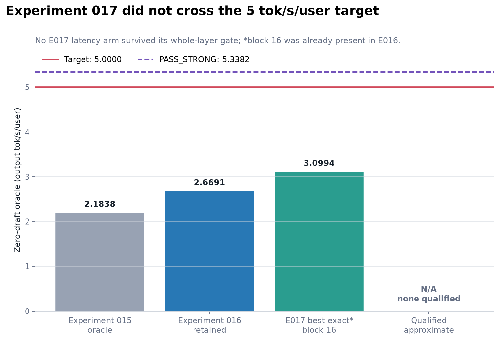
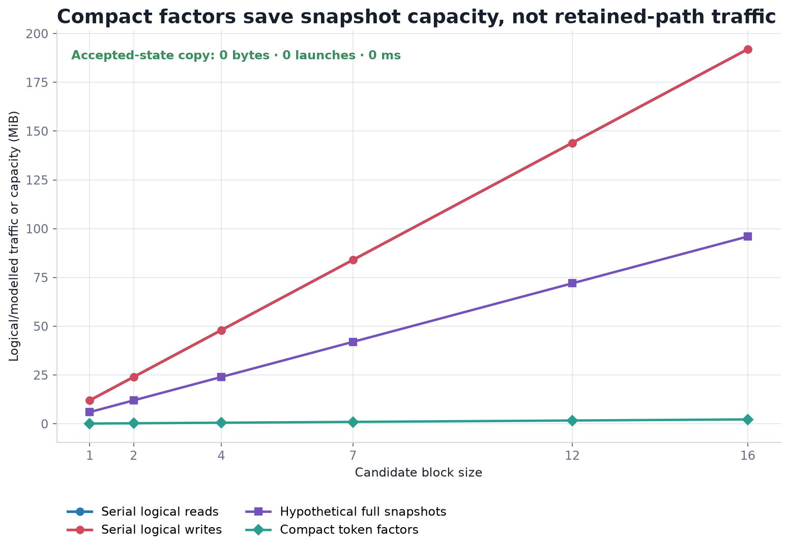
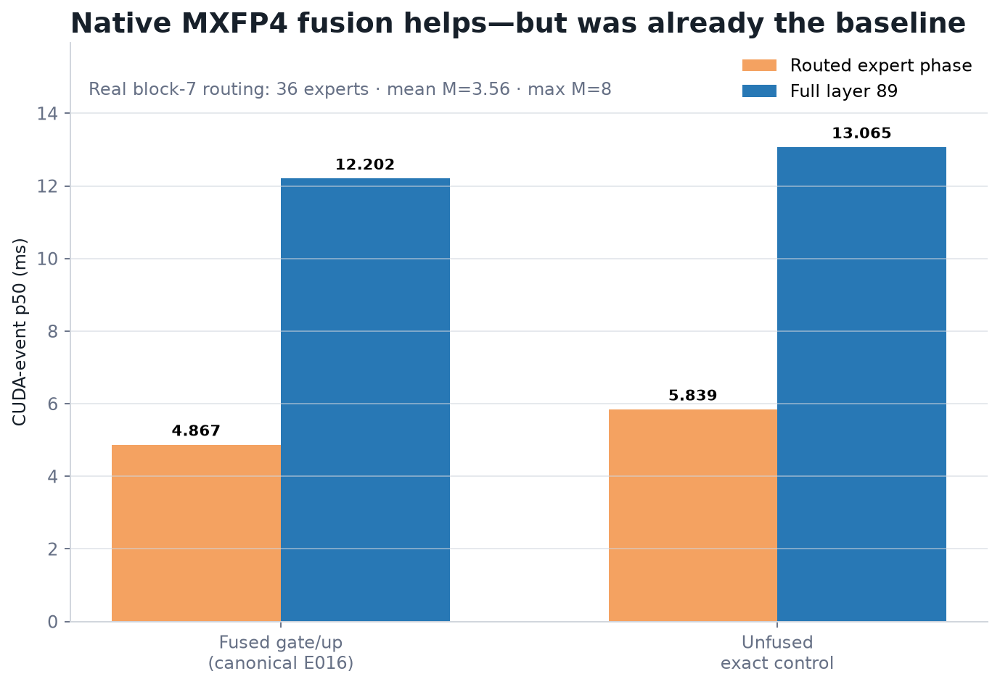
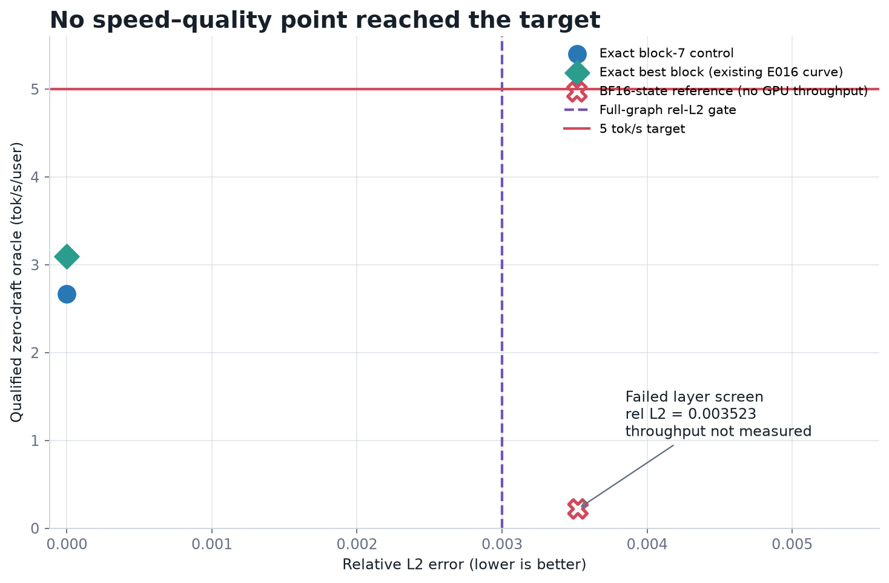
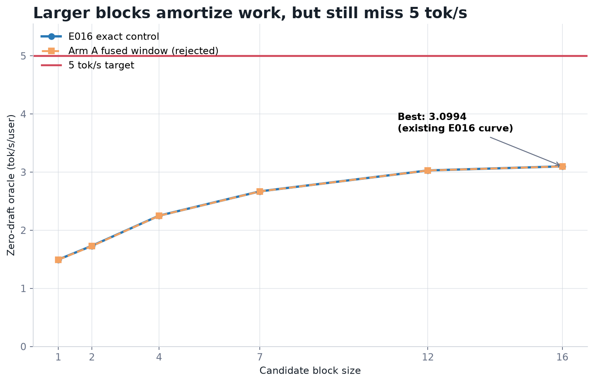
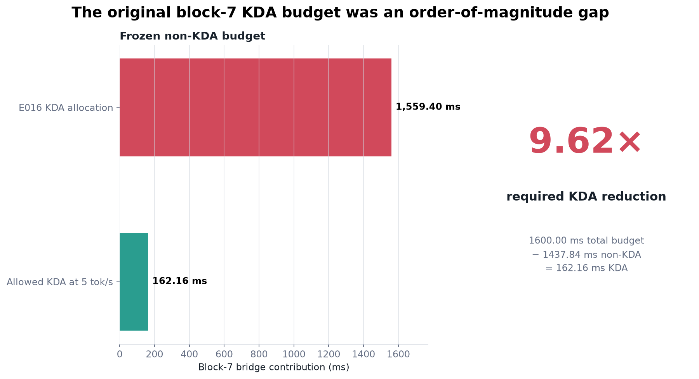
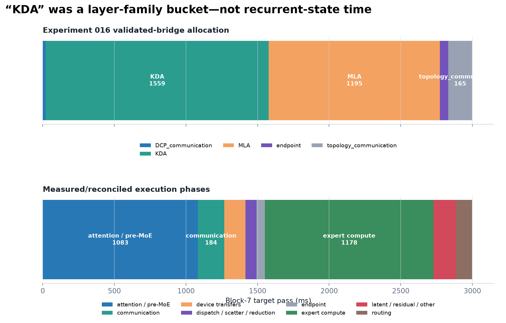

# Experiment 017: Breaking the KDA Target-Work Wall

**FAIL — exact.** The best exact zero-draft oracle is **3.0994 tok/s/user** at block 16 (**322.64 ms/accepted token**), 1.161× versus the fixed Experiment 016 block-7 denominator and 1.419× versus Experiment 015. It does **not** cross 5 tok/s/user. No Experiment 017 mechanism survived its whole-layer gate: the one-launch exact KDA window was marginally slower, direct accepted-state seeding was already present, exact factors reduced hypothetical snapshot capacity but not target wall time, replay added work, and the already-retained fused native MXFP4 expert path remained fastest. The decisive finding is that the recurrent KDA core itself is only a small fraction of the real layer; the original 1559.4 ms KDA allocation is not 1559.4 ms of state-update work.

> **The block-7 KDA budget to reach 5 tok/s is 162.16 ms. That requires a 9.62× reduction from the declared 1559.4 ms KDA allocation if the declared 1437.84 ms non-KDA work is frozen.**

## 1. Hypothesis

The hypothesis was that short-window KDA execution, compact exact state factors, eliminated acceptance copies, replay, and faster native expert service could reorganize Kimi K3 verification enough to reach 5 tok/s/user without changing the model, drafter, routing, topology, or DCP assumptions. Each arm followed hypothesis → implementation → benchmark → inspection → redesign. Exact and approximate evidence remained separate.

The implementation study used [FlashKDA](https://github.com/MoonshotAI/FlashKDA), [its design deep dive](https://github.com/MoonshotAI/FlashKDA/blob/master/docs/20260420-flashkda-v1-deep-dive.md), [vLLM's Kimi K3 fused-decode description](https://github.com/vllm-project/vllm-project.github.io/blob/main/_posts/2026-07-27-k3.md), [SGLang's KDA fusion release history](https://github.com/sgl-project/sglang/releases), [SpecLA](https://arxiv.org/abs/2607.16673), [Bole](https://arxiv.org/abs/2608.01651), and [Snakes and Ladders / Activation Replay](https://proceedings.mlr.press/v262/wu24a.html) as design references, not as transferable performance claims.

## 2. Hard targets

- PASS: ≥5.0000 tok/s/user, ≤200.0 ms/accepted token, and ≤1600.0 ms for block 7.
- PASS_STRONG: ≥5.3382 tok/s/user and ≤187.325 ms/accepted token.
- Fixed denominators: E015 = 2.1838203221 tok/s; E016 = 2.6691 tok/s.
- Initial block-7 budget: 1600.0 − 1437.84 = 162.16 ms of KDA, or 9.62× below 1559.4 ms.

The machine-readable calculation is in `artifacts/experiment-017/target-tracker.json` and is recalculated for every combined block.

## 3. Baseline reproduction

The immutable historical E016 result remains the denominator. The current block-7 reconstruction was **3031.67 ms**, **378.96 ms/accepted**, and **2.6388 tok/s/user**, a 1.15% latency deviation from 2997.24 ms. This passes the ±3% gate. Layer 89 was 1.75% slower and the 8K MLA control 0.60% slower than their immutable receipts. Historical and current results are both preserved; the current run did not establish a new denominator.

The physical fixture used real layer-89 and layer-91 weights, all 896 layer experts resident, and the three immutable full-graph boundaries from Experiment 014. The complete graph/oracle and topology remain the same conservative validated-model bridge as Experiment 016; this is not a physical 93-device or WAN measurement.

## 4. KDA mathematical analysis

For one head with state `H[key,value]`, the repository update is

`H_t = D_t H_(t-1) + β_t k_t (v_t − k_tᵀ D_t H_(t-1))ᵀ`.

Therefore `H_t = A_t H_(t-1) + C_t`, with `A_t = D_t − β_t k_t(D_t k_t)ᵀ` and `C_t = β_t k_t v_tᵀ`. Each transition is diagonal plus rank one; prefixes compose exactly, while transition and additive ranks grow by one per token. Candidate output `q_iᵀH_i` can be evaluated from the committed `H_0` and prefix factors without writing every `H_i`. The accepted state can be materialized once.

The exact float32 reference passed blocks 1/2/4/7/12/16. At block 7, output relative L2 was 1.877e-07, state relative L2 was 1.166e-07, and the factor ranks were 7. Compact KDA-specific token factors occupy 0.987 MiB versus 42.000 MiB for seven full snapshots, a 42.56× capacity reduction.

The wall-time result is the opposite: accepted reconstruction makes the analytical factor path about 1.020× the serial recurrence's scalar work, and the reference factor path was 3.05× slower. More importantly, the measured native recurrent core is only 0.04313 ms/token. Eliminating all eight block-7 core calls would cap real layer-89 speedup near 1.029×. C4 CUDA was therefore skipped under the experiment's own progression rule; a factor CUDA kernel could not plausibly close the system gap.

## 5. Short-window kernel results

Arm A compared two exact SM120 organizations on real layer 89:

- split: batched token-parallel projections plus one head-parallel recurrence launch per row;
- fused window: the same projections plus one head-parallel launch that advances every contiguous row.

At block 7, fused attention/pre-MoE took 3.1065 ms versus 3.1049 ms; full layer device time was 12.2111 versus 12.2016 ms. The output, state, routes, and active prefix were bit-identical, but the full layer regressed 0.078%. The recurrence launch count fell from 8 to 1; the saved launches were not visible at the whole-layer gate. CUDA Graph replay is not implemented by this native ABI, so the report records it as unsupported rather than substituting eager timing.

Nsight Compute 2025.3.1 was found and automated, but NVIDIA denied hardware-counter access with `ERR_NVGPUCTRPERM`. No DRAM, L2, occupancy, tensor-core, register, or shared-memory counter is fabricated. CUDA-event, CPU-wall, memory, logical launch, and traffic evidence remains available.

## 6. State-materialization results

Arm B's premise was already true in the retained zero-draft verifier: candidate rows share one session, recurrence advances the session state in place, and the all-accepted final state directly seeds the next round. Acceptance performs **0 bytes**, **0 copy/scatter launches**, and **0 ms** of accepted-state copying. A full KDA recurrent state is 6,291,456 bytes; convolution windows bring session KDA state to 6,881,280 bytes. The kernel's logical block-7 state loops read 88,080,384 bytes and write 88,080,384 bytes, but this is a source-level traffic estimate, not an HBM counter. Removing a copy that does not exist cannot improve the oracle.

## 7. Factorized verification results

Arm C is retained as a correct mathematical and memory-capacity reference, not as a latency path. Prefix composition, state reconstruction, partial acceptance, continued state, inactive slots, aliasing, repeated invocation, and every required block passed. The factor method saves hypothetical speculative snapshots; the retained zero-draft path never created those snapshots. Its full-state application and rank-growing work prevent a credible wall-time advantage at these short windows.

## 8. Replay/checkpoint results

Arm D exactly reproduced serial states for every block. Replay needs one committed checkpoint plus the compact factor/input buffer and repeats the recurrence after acceptance. Against a hypothetical snapshot-per-candidate design it saves capacity; against the retained in-place zero-draft path it adds 0.987 MiB and replay compute while saving no hot-path copy. This is a memory-capacity result only and was rejected as a latency solution.

## 9. Expert-service results

The available canonical backend consumes the checkpoint's native MXFP4 packed weights and uint8 scales directly, uploads them once, keeps all 896 active-layer experts resident, and uses float32 stage activations. Real block-7 routing had 128 assignments across 36 touched experts, mean M=3.556, maximum M=8, and 66 native expert calls.

Colibri's fused native MXFP4 gate/up path took 4.8665 ms for routed experts and 12.2016 ms for the full layer. The exact unfused control took 5.8393 and 13.0649 ms respectively. Fusion improved routed service 1.200× and is already the Experiment 016 control; it is not a new Experiment 017 gain. FlashInfer, Marlin, SGLang, and vLLM were not installed as compatible Windows/SM120/K3 execution primitives, so no unsupported large-M benchmark was promoted into Kimi evidence.

## 10. Precision matrix

The exact float32 control passed. A BF16 stored state with FP32 update arithmetic was evaluated only after the exact control. At block 16 its output relative L2 was 0.003523, active-state relative L2 0.004457, and final hidden relative L2 0.005382; the output already exceeds the full-graph 0.003 qualification tolerance. There was no GPU implementation or ≥1.5× whole-oracle result, so the expensive 93-layer qualification was correctly not rerun. FP8 projection/activation, MXFP4+BF16 activation, and MXFP4+FP8 activation modes are explicit unsupported/fail-closed configuration cells, not silent fallbacks. Result: **APPROX_FAIL**, with no qualified approximate oracle.

## 11. Exact combined result

No Experiment 017 arm survived its whole-layer latency gate, so the exact combined path retains Experiment 016 unchanged. The required block sweep is:

| Block | Accepted | Target ms | ms/accepted | tok/s/user | vs E016 | KDA ms | KDA budget |
| --- | --- | --- | --- | --- | --- | --- | --- |
| 1 | 2 | 1337.77 | 668.88 | 1.4950 | 0.560× | 679.65 | -258.12 |
| 2 | 3 | 1732.33 | 577.44 | 1.7318 | 0.649× | 938.19 | -194.14 |
| 4 | 5 | 2221.41 | 444.28 | 2.2508 | 0.843× | 1167.59 | -53.83 |
| 7 | 8 | 2997.24 | 374.65 | 2.6691 | 1.000× | 1559.37 | 162.13 |
| 12 | 13 | 4291.97 | 330.15 | 3.0289 | 1.135× | 2137.42 | 445.45 |
| 16 | 17 | 5484.92 | 322.64 | 3.0994 | 1.161× | 2769.96 | 685.03 |

Block 16 maximizes the zero-draft oracle at 3.0994 tok/s/user, but this is the already-known E016 block curve—not a new mechanism—and it remains below even the 1.25× threshold. At the primary block-7 control, the exact oracle is still 2.6691 tok/s/user.

## 12. Approximate combined result

There is no approximate combined system result. The only implemented approximate reference failed the layer-level numerical screen and had no GPU speed evidence. It is not assigned throughput and is not mixed with the exact curve.

## 13. Correctness

- Real fused-window and split layer-89 outputs: bit-identical; exact routes and active state.
- Exact factor reference: relative L2 ≤2e-5 for outputs and states at all required blocks.
- Replay and accepted-state reconstruction: exact within the same reassociation threshold.
- Real expert fused/unfused paths: bit-identical outputs, states, and routes.
- Full 93-layer Experiment 014 serial oracle remains the qualification anchor. It was not rerun for a precision arm that failed before the ≥1.5× gate.
- Targeted regressions: 53 passed, 0 skipped, 0 failed.
- Full repository: 1183 passed, 13 skipped, 0 failed. Exact counts and commands are recorded in `test-results.json`.

## 14. New bottleneck decomposition

Because no arm was retained, the reconciled block-7 decomposition remains KDA 1559.4 ms, MLA 1195.3 ms, endpoint 58.2 ms, topology 165.4 ms, and shaped DCP communication 18.9 ms. The more useful cross-layer phase decomposition is expert compute 1177.6 ms (39.29%) and attention/pre-MoE 1083.0 ms (36.13%). Neither component's zero-cost bound reaches 5 alone. The state recurrence is not the KDA allocation.

## 15. Zero-draft oracle

The primary question is answered negatively. The best exact curve peaks at 3.0994; block 7 remains 2.6691. Draft work can only add cost, so speculative proposal, acceptance, and drafter tuning were not run.

## 16. Economic projection

No PASS or STRONG_PARTIAL architecture exists, so there is no qualifying new commercial architecture. For continuity, the table applies the repository's declared $0.15/GPU-hour, 93-GPU-equivalent, 44.486-user target-only capacity model. These are projections, not physical bills:

| Architecture | tok/s/user | Aggregate tok/s | GPU-h/1M | $/1M |
| --- | --- | --- | --- | --- |
| Experiment 015 block 7 | 2.1838 | 97.15 | 265.91 | 39.89 |
| Experiment 016 block 7 | 2.6691 | 118.74 | 217.56 | 32.63 |
| Experiment 017 best exact (existing E016 block-16 curve) | 3.0994 | 137.88 | 187.36 | 28.10 |

The apparent E017 row is block-16 amortization already present in E016. It must not be interpreted as a newly achieved architecture.

## 17. What failed

- Maximum recurrence fusion removed launches but not layer wall time.
- Accepted-state copy elimination had no work to remove.
- Exact DPLR factors were mathematically valid but targeted hypothetical state snapshots, while accepted reconstruction restored the arithmetic cost.
- Replay saved hypothetical capacity but added compute to the retained in-place path.
- The native fused expert control was already optimized; the unfused control regressed.
- BF16 recurrent storage exceeded the numerical screen before any system-speed claim.
- Nsight counters were blocked by host permissions; the failed profiled timings are excluded.

## 18. What was retained

The default exact runtime remains the Experiment 016 verification-major path with fused native MXFP4 expert service. The exact short-window CUDA primitive is available only behind explicit `verification-major-kda-window` capability selection and fails closed if its native export is absent; it is not preferred. Precision modes round-trip explicitly and fail closed when unsupported. The factor/replay code remains a deterministic reference and capacity model.

## 19. Implications for Swarm Inference

Experiment 016's aggregate “KDA” allocation was a layer-family attribution, not evidence that recurrent-state traffic dominated. The real core measurement, the exact factor cost, and the full-layer fusion result jointly falsify the thesis that state handling alone can remove roughly 1.4 seconds from the bridged target pass. Fine-grained speculative work cannot repair a target-only path below 5 tok/s/user.

## 20. Recommendation for Experiment 018

Do not continue factor/replay KDA latency work. If Experiment 018 is run, its precondition should be a supportable SM120 tensor-core primitive for the real small-M native-MXFP4 K3 projection and expert shapes, and its gate must combine measured projection and MoE service through the same whole-verifier bridge. The measured phase roofline says both expert compute and attention/pre-MoE must move; optimizing either alone has a zero-cost bound below 5. If that backend is unavailable, stop rather than construct another scalar-kernel projection.

## Final decision

**NO, KDA OPTIMIZATION PATH FALSIFIED.**

## Artifact index

- Final analysis and tracker: `artifacts/experiment-017/summary.json`, `target-tracker.json`
- Raw physical evidence: `artifacts/experiment-017/physical/`
- Flat results: `artifacts/experiment-017/results/`
- Candidate binary and hashes: `artifacts/experiment-017/cuda/`
- Commands, environment, model identity, sources, tests, seeds, failures, and independent audit: `artifacts/experiment-017/`
