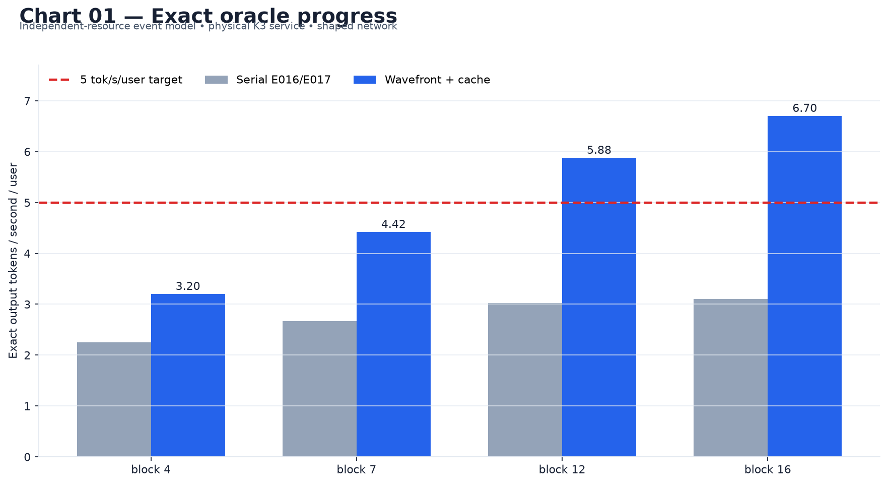
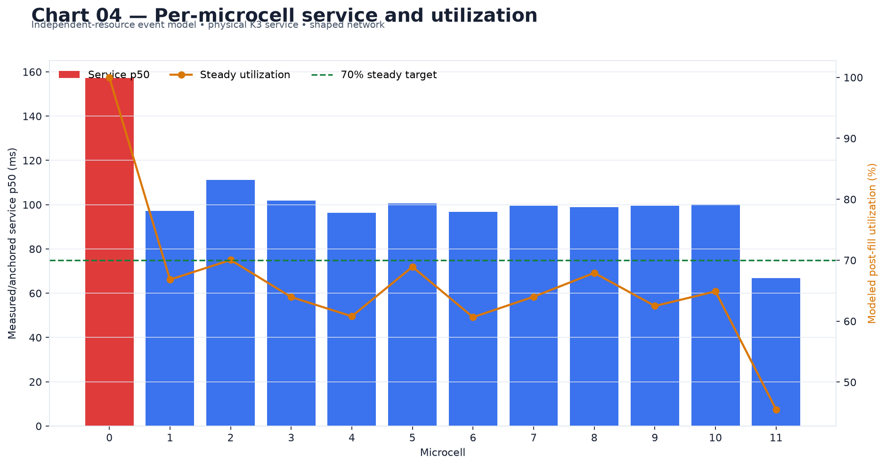
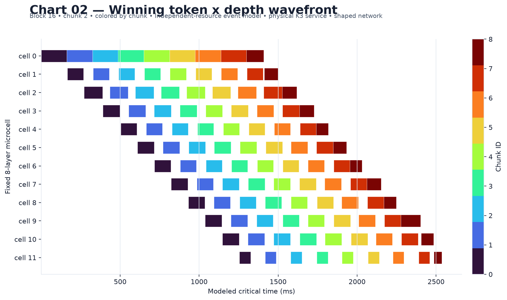
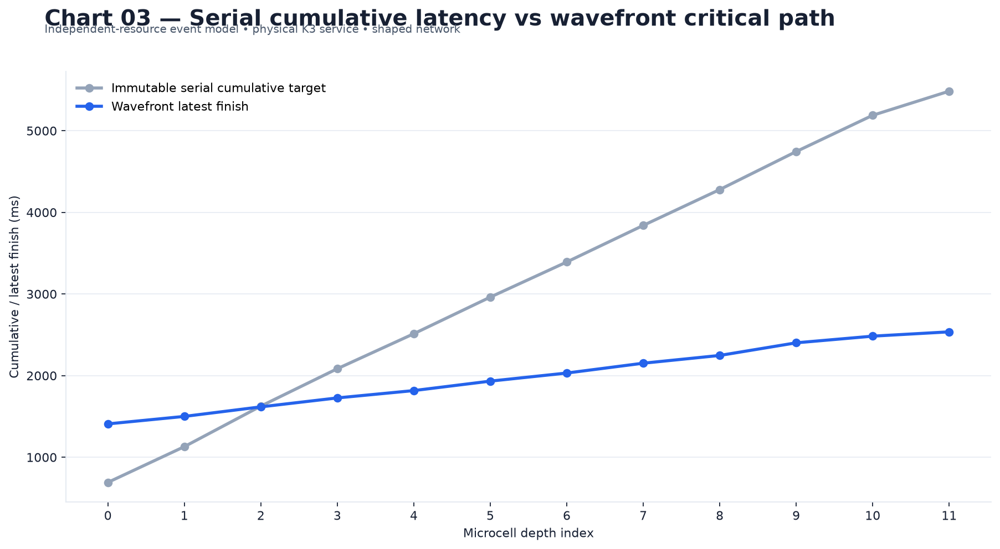
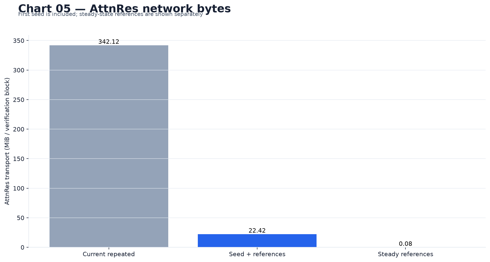
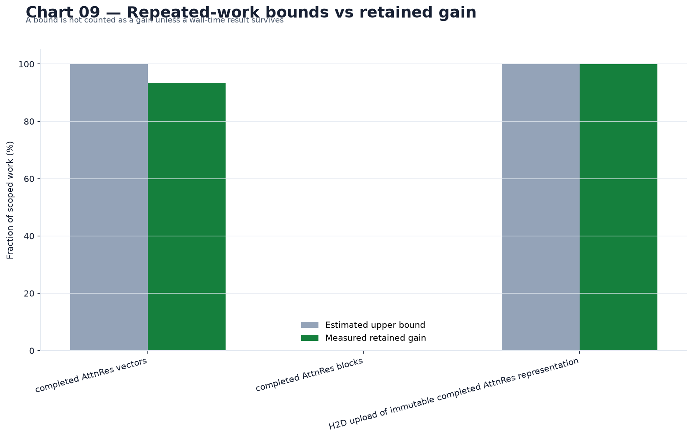
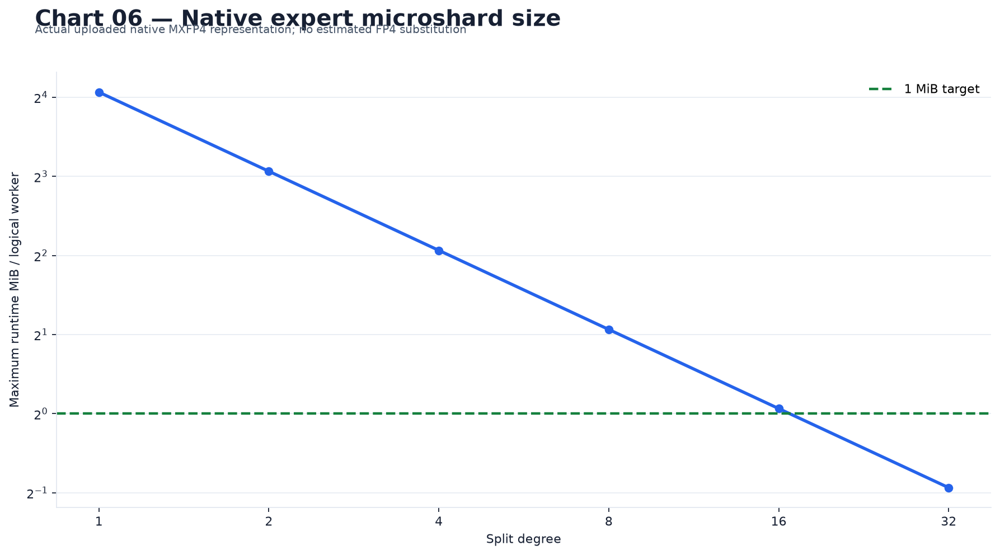
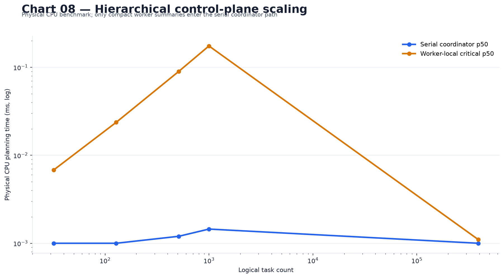
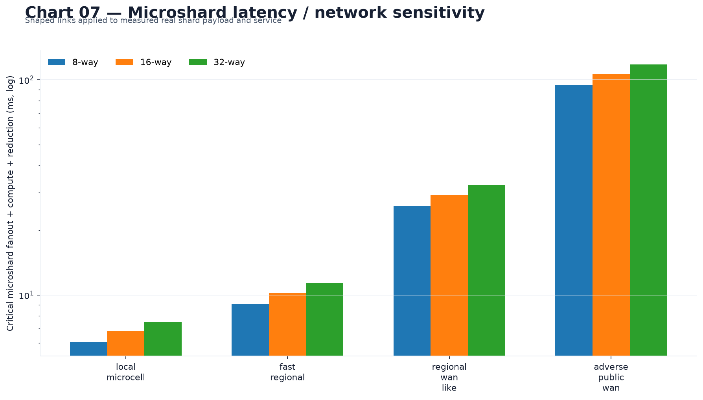
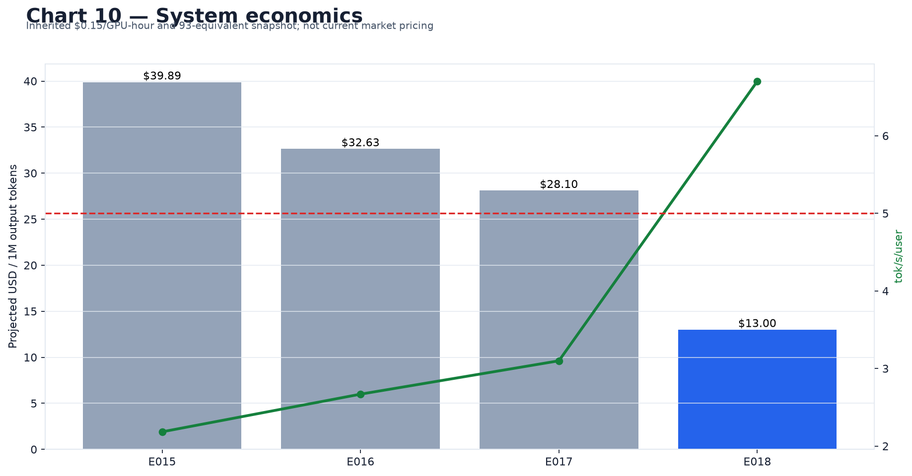

EXPERIMENT 018: PASS_STRONG

# Experiment 018: Wavefront Swarm Execution

- Best exact result: **6.7022 tok/s/user**.

- Winning verification block: **16 candidates / 17 accepted rows**.

- Winning chunk size: **2 row(s)**.

- Target pass: **2536.5 ms**, a **2.16x** speedup over the corresponding immutable serial baseline.

- Crossed 5 tok/s/user: **yes**.

- Crossed separate 7.5 tok/s/user breakthrough threshold: **no**.

- Wavefront pipeline efficiency: **83.8%**; median steady microcell utilization: **64.5%**.

- Bottleneck: **microcell 0**, layers 0-7, dominated by **dense_layer_0**.

- AttnRes bytes: **93.4% total reduction including first seed**, **99.98% steady-state reduction**.

- Highest physically validated exact expert split: **32-way**.

- Claim boundary: **VALIDATED INDEPENDENT-RESOURCE MODEL**, driven by physically measured real-K3 service on one RTX 5090 and explicit shaped communication. This is not a physical 12-GPU result and no physical WAN was measured.

## 1. Executive result

The central hypothesis passed its non-throughput architecture gates: exact chunks can cross depth boundaries without an all-block barrier, and the event trace yields an exact target critical path of 2536.5 ms. The complete fixed-resource-accounted architecture is Result F (coarse wavefront plus immutable AttnRes transport cache); the fine microshard model remains separate because its additional resource economics have no pinned conversion. The result is not classified as a separate breakthrough beyond the declared thresholds.

| hard gate | result |
|---|---|
| gate 1 chunk correctness | PASS |
| gate 2 measured all 12 cells | PASS |
| gate 3 wavefront shape and 1 25x | PASS |
| gate 4 primary 5 tok s | PASS |
| gate 5 attnres dedup 80 percent | PASS |
| gate 6 exact 32 way microshard | PASS |
| gate 7 control sublinear no 1000 waits | PASS |

Each major arm followed `hypothesis -> implementation -> benchmark -> inspect result -> redesign`:

| hypothesis | implementation | benchmark | inspect result | redesign / decision |
|---|---|---|---|---|
| Exact K3 positions can stream across depth | ordered token x depth DAG with carried KDA/conv/MLA state | 42 real-K3 monolithic-vs-chunk cases | all exactness gates passed | retain ordered release; forbid overtaking |
| Wavefront shortens the serial critical path | deterministic independent-resource event engine | 4 blocks x legal chunks, canonical links | best wavefront-only speedup 2.14x | retain measured slowest-stage schedule |
| Immutable AttnRes objects remove repeated transport | version/hash cache with first-seed accounting | all coarse block/chunk traces | total reduction 93.4% | retain; reject stale versions |
| Completed-block future scores save layer time | exact precompute reference | bit-exact score/output proof plus physical GPU bound | maximum full-layer bound 0.00% | reject until a measured faster full layer exists |
| Tiny native expert shards preserve the expert | gate/up row + down-column slices and stable weighted sum | real expert degrees 1/2/4/8/16/32 | exact through 32-way | retain compatibility; do not infer one-GPU speedup |
| Fine shard fanout adds useful parallelism | persistent shard resources + batched stable tree levels | Model D canonical-link event sweep | best 6.4791 tok/s/user | keep separate from fixed-resource headline and economics |
| Hierarchical control avoids one wait per shard | worker-local bucket/coalescing summaries | 32/128/512/1000/natural-count physical CPU sweep | serial scaling exponent -0.002 | retain compact persistent-worker hot path |

## 2. Primary goal

The question was whether schedule-level parallelism—not another isolated faster operator—could reduce one exact Kimi K3 verification critical path from a sum of 12 microcell services toward fill/drain plus the bottleneck service period. The fixed 8-layer, 12-microcell topology was held constant. The primary threshold was 5.0 tok/s/user under the inherited canonical 0.25 ms/25 Gb/s internal and 5 ms/10 Gb/s coarse shaped links.

## 3. Baseline reproduction

Fresh unchanged-code layer-89 KDA and layer-91 MLA measurements were reconciled against the historical exact denominator. Maximum curve deviation was 1.55%, inside the fixed ±3% gate. The historical curve—not the favorable rerun—remains the denominator. Routes, expert-major output, recurrent state prefix, and geometry were exact in the fresh receipt. Initial dirty state contained only the pre-existing `third_party/colibri` submodule modification.

| block | accepted | historical ms | fresh-reconciled ms | deviation | oracle |
|---|---|---|---|---|---|
| 1 | 2 | 1337.8 | 1345.5 | +0.58% | 1.4950 |
| 2 | 3 | 1732.3 | 1750.9 | +1.07% | 1.7318 |
| 4 | 5 | 2221.4 | 2240.1 | +0.84% | 2.2508 |
| 7 | 8 | 2997.2 | 3043.7 | +1.55% | 2.6691 |
| 12 | 13 | 4292.0 | 4355.2 | +1.47% | 3.0289 |
| 16 | 17 | 5484.9 | 5496.3 | +0.21% | 3.0994 |

Evidence: [`baseline/oracle-curve.csv`](evidence/baseline/oracle-curve.csv), [`physical/baseline-reproduction.json`](evidence/physical/baseline-reproduction.json), and [`source-manifest.json`](evidence/source-manifest.json).

## 4. Dependency analysis

The exact DAG has two dependency dimensions: same-chunk depth handoff and same-cell previous-chunk state. KDA recurrence and causal convolution require ordered chunk arrival at each layer; MLA requires its compressed-KV/RoPE cache through the prior position. Routing, experts, shared experts, LatentMoE reduction, residual updates, and endpoint work are row-local once their incoming hidden/state objects exist. Completed AttnRes snapshots are immutable for a request/block/chunk version and may be seeded downstream. Therefore a chunk may leave microcell N after N has updated all local recurrent/cache state for that chunk; it need not wait for the rest of the verification block. Overtaking within a stateful layer is prohibited.

| operator | cross-position dependency | release condition |
|---|---|---|
| KDA + causal conv | recurrent matrix + width-4 windows | state update committed |
| Gated MLA | compressed KV/RoPE cache | KV appended and causal result complete |
| routing / experts / LatentMoE | none beyond incoming row | stable routed/shared reduction complete |
| AttnRes | immutable versioned snapshots | snapshot/reference ready |
| residual / endpoint | same-row hidden and snapshots | residual or logits complete |

The first-class task objects carry request, block, chunk, cell, dependency IDs, input/state references, and versioned output references. Full proof: [`dependencies/k3-wavefront-dag.json`](evidence/dependencies/k3-wavefront-dag.json).

## 5. Exact chunk-equivalence proof

The physical proof swept monolithic blocks 4/7/12/16 against chunk sizes 1/2/4/8 where legal on real K3 snapshot-KDA, later KDA, and MLA layers. All 42 cases passed the predeclared 2.0e-06 relative-L2 gate; operation order that remained unchanged was bit-identical, and recurrent/conv/MLA state fingerprints matched as recorded. The full-layer calls include routing, routed/shared experts, LatentMoE, residuals, and AttnRes. The inherited exact 93-layer endpoint/logits and greedy-token anchor remains `artifacts/experiment-014/oracle-full-93/serial-oracle-receipt.json`; this experiment did not pretend the partial physical layer sweep was a new full-model generation.

| attention type | physical layer | cases | all pass | max output relative L2 |
|---|---|---|---|---|
| Gated_MLA | 91 | 14 | True | 0.000e+00 |
| KDA | 89 | 14 | True | 0.000e+00 |

Evidence: [`dependencies/chunk-equivalence.json`](evidence/dependencies/chunk-equivalence.json).

## 6. Physical microcell measurements

Each of the 12 fixed cells received fresh service inputs from two real checkpoint layers matching its local KDA/MLA composition, across rows 1/2/4/8, with p50/p90/p99 wall, CUDA, host, routing, expert, attention, LatentMoE, AttnRes/residual, state-update and output-preparation phases. The inherited runtime co-measures recurrent/cache state update with attention and AttnRes with residual; these are labeled joint measurements rather than falsely separated. Dense layer 0 and LM-head edges use identified inherited E014 physical p50s. One global factor per row size anchors the sum to the immutable exact serial compute after subtracting inherited topology transport; it does not flatten measured cell imbalance. Repeated checkpoint loading is separately timed and excluded from resident compute service. Because a single full routed layer materializes roughly 18 GiB, several composed resident microcells exceed 32 GiB and require the intended sub-layer distribution; one RTX 5090 was never treated as 12 independent devices.

Evidence: [`physical/microcell-service.csv`](evidence/physical/microcell-service.csv), [`physical/layer-service.csv`](evidence/physical/layer-service.csv), and [`physical/gpu-samples.csv`](evidence/physical/gpu-samples.csv).

## 7. Stage balance

| chunk | max ms | mean ms | median ms | CV | max/mean | slowest | ceiling rows/s |
|---|---|---|---|---|---|---|---|
| 1 | 119.14 | 81.63 | 80.88 | 0.211 | 1.46 | 9 | 8.39 |
| 2 | 157.14 | 102.17 | 99.58 | 0.189 | 1.54 | 0 | 12.73 |
| 4 | 262.46 | 153.94 | 147.92 | 0.230 | 1.70 | 0 | 15.24 |
| 8 | 433.55 | 235.98 | 223.75 | 0.266 | 1.84 | 0 | 18.45 |

At the winning chunk size, the slowest stage is cell 0. The steady-state ceiling shown above is rows divided by that measured/anchored maximum service before network. This stage, rather than the mean, drives the event model.

## 8. Wavefront scheduler implementation

The deterministic engine schedules from explicit dependencies and independent resource IDs. For `(cell, chunk)`, start is the maximum of previous chunk finish on that cell, same-chunk arrival from the prior cell, local state readiness, and required AttnRes object readiness. Compute, handoff, seed, reference, reduction and control events each occupy an explicit resource and duration; resource contention adds a predecessor to the realized critical path. The engine emits every event, resource utilization, simulation CPU time, and the realized critical predecessor chain. Persistent logical workers have bounded request state, long-lived queues and caches, duplicate/loss/stale-version rejection, deterministic retry/restart and cleanup.

## 9. Wavefront results

| result | block | chunk/split | ms | tok/s/user | evidence |
|---|---|---|---|---|---|
| A serial | 16 | — | 5484.9 | 3.0994 | historical exact |
| B wavefront | 16 | 2 | 2558.6 | 6.6443 | independent-resource model |
| C + AttnRes cache | 16 | 2 | 2536.5 | 6.7022 | independent-resource + shaped network |
| D + microshards | 16 | 2/8x | 2623.8 | 6.4791 | additional independent shard resources |
| E retained repeated work | 16 | 2 | 2536.5 | 6.7022 | no unmeasured speedup multiplication |
| F complete exact | 16 | 2 | 2536.5 | 6.7022 | fixed-resource-accounted headline |

Result D is not used to inflate Result F. It models extra independently scheduled expert shards and stable tree reductions, while Result F retains fixed-resource accounting and only co-executed effects. No speedups were multiplied after the fact.

| block | winning chunk | target ms | tok/s/user | serial speedup | efficiency | median util. | chunks in flight |
|---|---|---|---|---|---|---|---|
| 4 | 2 | 1562.0 | 3.2011 | 1.42x | 94.8% | 18.8% | 3 |
| 7 | 2 | 1809.6 | 4.4208 | 1.66x | 88.9% | 23.2% | 4 |
| 12 | 2 | 2211.6 | 5.8780 | 1.94x | 86.4% | 32.3% | 7 |
| 16 | 2 | 2536.5 | 6.7022 | 2.16x | 83.8% | 64.5% | 9 |

## 10. Pipeline fill/drain analysis

For the winning configuration, fill was 1255.2 ms, steady stage period 162.4 ms, and drain 49.7 ms. Pipeline efficiency is defined exactly as balanced pipeline latency from the mean measured stage compute service for each actual chunk, excluding handoff, divided by observed event-DAG makespan including communication and control. The decomposition in `wavefront/sweep.csv` separately records balanced fill/drain, stage-imbalance loss, explicit shaped communication, state barriers and measured control setup. Recurrent state forces chunk order within each cell but does not restore an all-block depth barrier. Median steady utilization was 64.5% against the 70% target; pipeline efficiency was 83.8% against the 65% target. Diagnosis: **stage imbalance: cell 0 has 1.54x mean service**. The best configuration satisfying both utilization targets was block 16 / chunk 1: 5.5428 tok/s/user at 79.4% median steady utilization and 79.1% efficiency. Thus the throughput conclusion does not depend on retaining a utilization-target miss.

## 11. Critical-path analysis

Useful parallelism is defined as total compute work divided by compute-equivalent work on the realized critical path; it is **4.50x**. Critical-path fraction is event-DAG makespan divided by the sum of serial component latencies; it is **0.198**. The winning trace sent 459 messages (27.00 per accepted token) but incurred only 31 realized critical-path waits (1.82 per accepted token): messages are not automatically serialized waits. Critical-path communication was 35.0 ms and explicitly included.

For Chart 03, the immutable corresponding serial target-pass latency is allocated across cells in proportion to the measured/anchored compute work; the wavefront line uses actual event finishes. This preserves the historical denominator while making the depth comparison readable.

Full chain: [`wavefront/critical-path.json`](evidence/wavefront/critical-path.json).

## 12. AttnRes immutable-object cache

The cache keys completed snapshots by object type, request/model scope, version and content hash. The producer seeds each downstream path once; later boundary messages carry changing hidden rows plus compact IDs. The complete accounting includes 23419392 seed bytes, 86400 reference bytes, 3600 hits, 0 misses and 0 invalidations. Total completed-AttnRes traffic fell 93.4%, and steady repeated traffic fell 99.98%; the first seed is not omitted. Output semantics are unchanged because stale versions are rejected.

## 13. AttnRes future-score cache

For an immutable completed block `v_b`, `depth_query[l] · RMSNorm(v_b)` is independent of future token state, so computing it at block creation is algebraically identical. The reference precomputed 185 future query rows and kept prefix score, softmax order and accumulation unchanged; cached scores and final AttnRes outputs were bit-identical. The physical GPU experiment measured an upper bound of 0.00% of a real layer. This is an upper bound, not a cached kernel measurement, so the arm was not retained and contributes 0 ms to Result E/F.

## 14. Repeated-work audit

| operation | exact cache? | implemented | upper bound | measured gain |
|---|---|---|---|---|
| repeated boundary transport of completed AttnRes vectors | True | True | remove all repeated vectors after one downstream seed | 0.9344775444145049 |
| RMS normalization and depth-query dot for completed AttnRes blocks | True | reference only; not retained | 0.0 | 0.0 |
| H2D upload of immutable completed AttnRes representation | True | True | one seed per consumer instead of every boundary | 0.9997591597780416 |
| expert pointer-map construction | False | False | bounded by measured host overhead; route state is mutable | None |
| static tensor descriptor construction | True | True | below measured per-layer host overhead | included in persistent physical service, not isolated |
| native MXFP4 weight repacking | True | True | all per-token repacking eliminated | already absent from hot path |
| checkpoint layer loading | True | persistent-worker architecture | 4847167.839 ms excluded from resident service sweep | loading separately measured and excluded, never counted as speedup |
| route metadata transformation | False | False | none for token-dependent values | None |
| temporary allocation/fill and state-copy audit | True | True | bounded by measured host overhead | preallocated in inherited persistent K3 stage; no new E018 gain |
| host synchronization and per-layer task/process creation | True | True | coordinator critical control time | reported by control-plane benchmark |
| identical completed-block projection moved to producer | True | False | not isolated; subsumed by future-score bound | None |

The audit rejected mutable route metadata and low-bound work rather than optimizing it for appearance. Only the transport cache and already-persistent static runtime state survive. The optional tiny-M audit reused the pinned E017 real K3 M about 1-8 comparison: native fused MXFP4 was 1.20x faster than its exact unfused control, but it was already the canonical E016/E017 path, so its incremental E018 gain is zero; no other compatible installed backend existed.

## 15. Expert microshard correctness

Real layer-89 expert 885 native MXFP4 tensors were physically sliced at degrees 1/2/4/8/16/32. Gate and up rows and matching down columns were uploaded as independent tensor objects; no degree >1 worker owned the full expert or another shard's activation. Stable FP32 reconstruction and route-weight-before-reduction reconstruction passed the fixed 2.0e-06 relative-L2 gate for all row sizes. The highest validated degree is 32; 64-way is incompatible with the native 32-value scale grouping because 3072/64=48 would split groups.

| split | native max MiB | runtime max MiB | input B | output B | exact |
|---|---|---|---|---|---|
| 1 | 16.734 | 16.734 | 14336 | 14336 | True |
| 2 | 8.367 | 8.367 | 14336 | 14336 | True |
| 4 | 4.184 | 4.184 | 14336 | 14336 | True |
| 8 | 2.092 | 2.092 | 14336 | 14336 | True |
| 16 | 1.046 | 1.046 | 14336 | 14336 | True |
| 32 | 0.523 | 0.523 | 14336 | 14336 | True |

## 16. Expert microshard economics

At 32-way and M=1, the worker holds 548352 runtime bytes (0.523 MiB), below the 1 MiB target. Input is 14336 bytes, output contribution 14336 bytes, and gate/up intermediates remain local. A routed layer creates 512 logical shard contributions per token, or 47104 across 92 routed layers before batching. Against the measured M=1 whole expert, the canonical local link leaves -7.221 ms raw compute margin (0.000 ms feasible); a non-positive raw value means fanout/reduction latency alone loses. Marketplace price and availability are unpinned, so economic viability is explicitly unproven.

## 17. Fine-grain wavefront model

Model D fans actual top-16 routes to persistent `(layer, expert, shard)` resources, applies route weights before a stable expert-ID/shard-ID tree, batches each reduction level, and rejoins non-expert work. Its immutable route fixture contains three real positions for every routed layer and is cycled for longer blocks; it is an exact execution fixture, not a claim about the population route distribution. Its best exact event result was 6.4791 tok/s/user at 2623.8 ms. Physical one-GPU shard timings establish service and size only; independent shard overlap is modeled, never claimed as measured. The difference from Model C shows whether fine fanout/reduction communication helps or harms rather than assuming a 32x speedup.

## 18. Control-plane scaling

| logical tasks | physical launches | coalescing | coord. p50 ms | local critical ms | serial decisions | critical waits |
|---|---|---|---|---|---|---|
| 32 | 32 | 1.00x | 0.0010 | 0.0068 | 16 | 5 |
| 128 | 128 | 1.00x | 0.0010 | 0.0237 | 16 | 5 |
| 512 | 192 | 2.67x | 0.0012 | 0.0899 | 16 | 5 |
| 1000 | 192 | 5.21x | 0.0014 | 0.1751 | 16 | 5 |
| 391074 | 12288 | 31.83x | 0.0010 | 0.0011 | 16 | 5 |

The measured serial coordinator log-log exponent was -0.002, below 1. At 1000 tasks there were 5 critical waits, not 1000, and 0.0014 ms serial coordinator p50. Counts through 1000 use expanded worker-local task fixtures; the natural full count is 391074 and uses exact prebucketed persistent-worker counters, because creating every shard object centrally would itself violate the architecture. Fixture construction is measured and reported separately but excluded from planner critical time: in the architecture those counters arise while local routing groups assignments, not through central task creation. The offline event simulator still enumerates every event to make the scientific trace auditable; that simulation CPU time is reported separately and is not asserted to be the runtime control path. Worker-local bucketing coalesces tasks sharing operation, shape, dtype, expert, weight shard and route bucket; logical-task and physical-launch counts are separately recorded. The CPU-only planner has no meaningful compute-idle interval; per-worker idle milliseconds are instead recorded from each wavefront event trace as makespan times one minus stage utilization.

## 19. Network sensitivity

| profile | RTT | Gb/s | 8-way ms | 16-way ms | 32-way ms |
|---|---|---|---|---|---|
| local_microcell | 0.25 | 25.0 | 6.04 | 6.78 | 7.52 |
| fast_regional | 1.0 | 10.0 | 9.10 | 10.22 | 11.34 |
| regional_wan_like | 5.0 | 1.0 | 25.94 | 29.16 | 32.39 |
| adverse_public_wan | 20.0 | 0.1 | 94.33 | 106.11 | 117.88 |

RTT dominates the stable reduction depth well before bandwidth does. No tested shaped-link profile beats the measured whole expert at these M=1 microshard shapes; compatibility does not establish latency viability. Regional and public-WAN-like links are therefore rejected as tensor-level microshard boundaries. The coarse sweep separately covers inherited coarse RTT 1/5/10/20/50/100 ms and bandwidth 0.1/1/10 Gb/s in `wavefront/network-sensitivity.csv`; the headline stays at the inherited 5 ms/10 Gb/s setting.

## 20. Correctness

Chunk legality passed real KDA, convolution, MLA, routing, experts, shared experts, LatentMoE, AttnRes and residual boundaries through the physical full-layer runtime. Routes/expert order and recurrent/conv/MLA state fingerprints are in the physical receipt. Microshard and route-weighted stable reductions pass their fixed tolerance. Future-score caching is bit-identical but unretained. The event schedule changes inter-cell timing, not numerical operation order within a stateful layer. Endpoint/logits and greedy-token availability are anchored to the inherited exact full-93 reference; no threshold was weakened after observing results.

## 21. Failure/recovery behavior

The first physical sweep stopped after five prior layers were complete in atomic receipt when an external telemetry sampler violated the CUDA PREPARE quiescence contract. The redesign delayed sampling until READY and resumed by atomic immutable layer key; no incomplete-layer measurement was retained, while five already-complete layer receipts were preserved. A later one-hour shell watchdog expired after layer 83; the same atomic rule resumed the final layers, and one obsolete-path retry failed before loading any state. The first future-score extractor also failed before timing because it looked for materialized score tensors; inspection of the real runtime showed that K3 constructs each score query as residual-norm times residual-projection, which the retained extractor now reproduces from checkpoint factors. Fault tests cover worker task failure, lost and duplicate chunks, stale cache objects, reduction-child failure, scheduler retry, worker restart and failed-request cleanup. These are bounded abstraction tests, not a claim of complete distributed fault tolerance.

## 22. Final oracle

| result | block | chunk/split | ms | tok/s/user | evidence |
|---|---|---|---|---|---|
| A serial | 16 | — | 5484.9 | 3.0994 | historical exact |
| B wavefront | 16 | 2 | 2558.6 | 6.6443 | independent-resource model |
| C + AttnRes cache | 16 | 2 | 2536.5 | 6.7022 | independent-resource + shaped network |
| D + microshards | 16 | 2/8x | 2623.8 | 6.4791 | additional independent shard resources |
| E retained repeated work | 16 | 2 | 2536.5 | 6.7022 | no unmeasured speedup multiplication |
| F complete exact | 16 | 2 | 2536.5 | 6.7022 | fixed-resource-accounted headline |

The exact complete headline is **6.7022 tok/s/user**, block 16, chunk 2, at **2536.5 ms**. It is a **2.16x** critical-path reduction over the corresponding serial block. The result class is **PASS_STRONG** and the claim class remains **VALIDATED INDEPENDENT-RESOURCE MODEL + SHAPED NETWORK**.

## 23. Economics

| architecture | tok/s/user | aggregate tok/s | GPU-h/M | USD/M | vs E017 cost |
|---|---|---|---|---|---|
| E015 retained block 7 | 2.1838 | 97.15 | 265.91 | 39.89 | +41.9% |
| E016 retained block 7 | 2.6691 | 118.74 | 217.56 | 32.63 | +16.1% |
| E017 best exact block 16 | 3.0994 | 137.88 | 187.36 | 28.10 | +0.0% |
| E018 complete coarse wavefront + AttnRes cache | 6.7022 | 298.16 | 86.64 | 13.00 | -53.8% |

The repository's inherited $0.15/GPU-hour assumption has no pinned market-snapshot date and is not presented as current pricing. The E018 row uses 44.4863908 retained user slots and 93 paid GPU equivalents, exactly as inherited. Fine microshard resources are excluded from the complete economics because no honest equivalent-price conversion is pinned.

## 24. What failed

The future-score arm did not earn retention: exact algebra was proven, but only an upper bound—not a measured faster full layer—was available. Worldwide tensor-level microsharding failed the latency-sensitivity test because reduction RTT compounds by tree depth. Sequential execution of 32 shards on one RTX 5090 did not and could not establish parallel speedup. The physical telemetry design failed once under the PREPARE contract and was corrected before completing the service sweep. Any fine-grain result that consumes additional unpriced independent resources was barred from inflating the fixed-resource Result F.

## 25. What was retained

Retained mechanisms are the dependency-derived deterministic wavefront, persistent worker/request state, explicit resource contention and communication events, the immutable AttnRes object transport cache, hierarchical local scheduling/coalescing, stable weighted expert reductions, and exact 32-way native microshard compatibility. The historical serial denominator and fixed topology remain unchanged.

## 26. Implications for Swarm Inference

Wavefront execution changes the relevant scaling quantity: critical-path fraction fell to 0.198 while useful parallelism rose to 4.50x. This validates pipelining across independently resident depth resources. Tiny expert workers are mathematically and physically representable below 1 MiB native material at 32-way, but only low-latency local groups are credible and their marketplace economics remain unmeasured. Pipeline validity and tiny-worker economics are therefore separate conclusions.

## 27. Exact recommendation for Experiment 019

Move to a rented low-latency multi-GPU cluster with persistent 8-layer logical cells, physically overlap the winning chunk schedule, seed the immutable AttnRes cache, and compare the measured physical event trace against E018 prediction. Add real shard fanout/reduction only inside a low-RTT microcell and price those resources separately. The decisive falsification test is model prediction error on target-pass latency; do not reopen topology search or broaden into unrelated kernels first.

---

**Can wavefront execution make the current Swarm architecture a credible path to >=5 Kimi K3 tok/s/user while remaining compatible with tiny sub-layer workers?**

**YES, BUT MICROSHARD ECONOMICS REMAIN UNPROVEN**

The measured evidence is 6.7022 tok/s/user at 2536.5 ms for block 16 / chunk 2, a 2.16x reduction over serial, with 83.8% pipeline efficiency and 93.4% total AttnRes-byte reduction. All real-K3 chunk cases and physical 32-way expert slices passed exactness gates. The throughput result still assumes independent resident microcells and shaped links rather than a physical multi-GPU run, and the 32-way worker marketplace cost remains unpinned; that is the remaining boundary between architectural credibility and deployed proof.
