EXPERIMENT 019: MODEL_INVALID

# No-Monolith Kimi K3 Swarm

- Best provisional worker-event output: **20.8836 tok/s/user — INADMISSIBLE because Gate 7 failed**
- Worker memory cap: **20 GiB**
- Maximum actual accounted worker peak: **4.4946 GiB**
- Total physical workers: **376**
- Workers per locality pod: **8**
- Stripe degree / depth span: **8 / 2**
- Block / chunk: **16 / 1**
- Target pass: **814.04 ms**
- Full 93-layer sharded correctness: **PASS**
- Bottom-up full-target reconstruction error: **103.91%**
- Maximum layer fraction owned by one headline worker: **12.678%**
- Maximum routed/shared expert fraction: **12.500%**
- Evidence class: **single RTX 5090 physical shard service + deterministic bounded-worker architecture model; no physical multi-GPU swarm**

## Required truth table

| Question | Answer |
|---|---|
| Does any worker hold a complete 8-layer microcell? | NO |
| Does any worker hold a complete transformer layer? | NO |
| Does any headline worker hold a complete routed expert? | NO |
| Maximum worker peak memory | 4.4946 GiB |
| Maximum fraction of one layer owned by one worker | 12.678% |
| Maximum fraction of one expert owned by one worker | 12.500% |
| Is the entire 1.5+ TB K3 checkpoint assigned? | YES |
| Can arbitrary expert routes execute without weight movement? | YES |
| Was the complete 93-layer graph executed through shard paths? | YES |
| Is throughput generated from worker-level events? | YES |
| Was a physical multi-GPU swarm measured? | NO |
| Was a physical RTX 3090 measured? | NO |
| Does the bounded-worker model exceed 5 tok/s/user? | NO |

## 1. Executive result

The explicit-worker scheduler numerically produces 20.8836 tok/s/user at the canonical hierarchical network with 376 workers, but that number is INADMISSIBLE as a throughput claim because the unnormalized serial reconstruction misses block 16 by 103.9%. The scientific classification is therefore MODEL_INVALID. The Tier-A capacity question is YES; RTX 3090 throughput remains NOT PHYSICALLY TESTED.

Gate 7 failed by a wide margin. The classification follows the declared gates mechanically: the 20.8836 figure is retained as diagnostic scheduler output, not reported as validated Swarm throughput. Gate 10 therefore also fails: a number above five cannot override failed serial reconstruction.

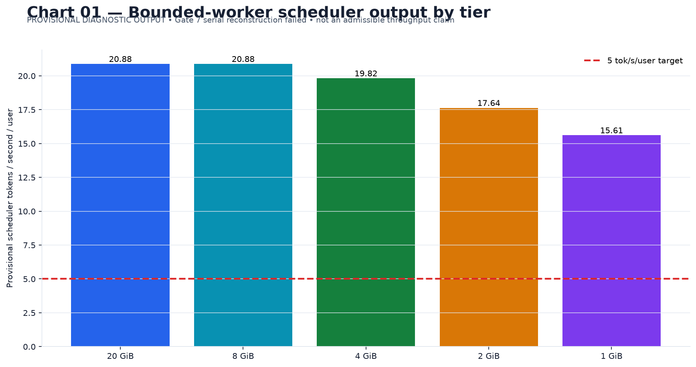

The plotted tier frontier is provisional diagnostic output from the explicit-worker scheduler. Because the shared service model fails Gate 7, none of these tier points is an admissible throughput result; invalid placements are still omitted rather than plotted as zero.

## 2. What Experiment 018 did and did not prove

Experiment 018 physically proved streamed exact verification chunks, 32-way expert fragments, a 6.7022 tok/s/user independent-resource wavefront, and effective immutable AttnRes transport caching. Its winning compute resources were logical eight-layer microcells holding roughly 122–136 GiB, so it did not prove consumer-sized workers. Experiment 019 uses the E018 result only as historical comparison and as the coarse 2536.46 ms control; no E018 microcell or layer service is used as a headline compute resource.

## 3. Exact Swarm thesis tested

The tested claim is whether exact Kimi K3 target inference can be reconstructed entirely from memory-bounded sub-layer workers, with every synchronization and transfer charged, and still exceed 5 tok/s/user. The target remains the zero-draft target oracle: block 16 must finish in at most 3400 ms.

## 4. Anti-monolith rules

Pods contain topology only. They have no service-time, model-byte, throughput, or aggregate-GPU field. Compute events accept exactly one `worker_id` and `resource_type=microworker`; the trace assertion rejects `microcell`, `layer`, `stage`, and `aggregate_gpu`. P=2 is retained only as a physical control.

| Gate | Status | Receipt |
|---|---|---|
| Gate 1 | PASS | placement/tensor-coverage.csv |
| Gate 2 | PASS | placement/worker-manifest-20g.json |
| Gate 3 | PASS | placement/worker-manifest-20g.json |
| Gate 4 | PASS | placement/checkpoint-read-audit.json |
| Gate 5 | PASS | correctness/kda-layer.json; correctness/mla-layer.json |
| Gate 6 | PASS | correctness/full-93-sharded.json |
| Gate 7 | FAIL | validation/serial-reconstruction.csv; validation/baseline-comparison.csv |
| Gate 8 | PASS | correctness/expert-stripe.json |
| Gate 9 | PASS | artifacts/experiment-019/simulation/event-traces/winning-tier-a.json |
| Gate 10 | FAIL | simulation/worker-sweep.csv |

## 5. K3 checkpoint partition

The Safetensors census covers **497,220 tensors** and **1,560,860,324,864 declared payload bytes** across 96 shards. Header offsets, shapes, dtypes, and index ownership agree byte-for-byte. The census includes embeddings, all 93 transformer layers (69 KDA and 24 Gated MLA), every routed expert 0–895 in each MoE layer, shared experts, routers, latent projections, AttnRes tensors, endpoint weights, and multimodal tensors.

## 6. Worker memory envelopes

Peak memory is static weights + recurrent/KV/AttnRes state + activations + scratch + reduction/network buffers + CUDA workspace + a measured/accounted allocator margin. Checkpoint bytes alone are never reported as peak memory.

| Cap | Best tok/s | Workers | P | Depth | Peak GiB | Block/chunk |
|---|---|---|---|---|---|---|
| 20 GiB | 20.8836 | 376 | 8 | 2 | 4.495 | 16/1 |
| 8 GiB | 20.8836 | 376 | 8 | 2 | 4.495 | 16/1 |
| 4 GiB | 19.8199 | 744 | 8 | 1 | 2.509 | 16/1 |
| 2 GiB | 17.6376 | 1488 | 16 | 1 | 1.261 | 16/1 |
| 1 GiB | 15.6129 | 2976 | 32 | 1 | 0.661 | 16/1 |

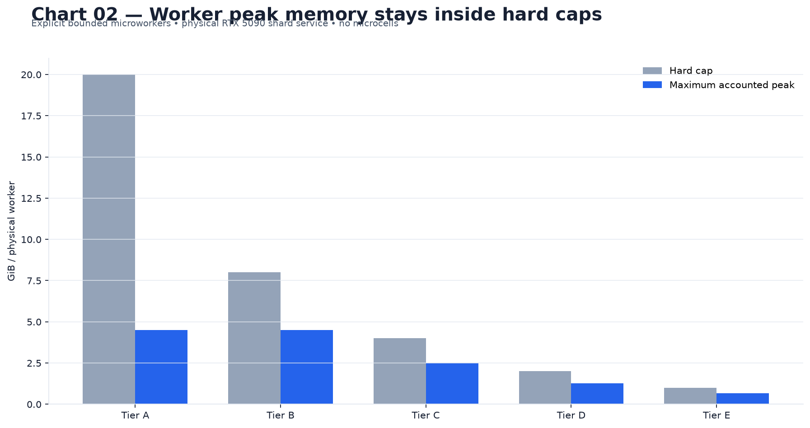

## 7. Complete worker placement

Each tier has an immutable manifest. The detailed tensor-to-worker byte ranges live in `placement/tensor-coverage.csv`; each worker manifest points to its filter and records its layer range, expert stripe, attention heads, state owners, hashes, and full memory envelope. Total resident required weight bytes are reconciled against the original checkpoint payload.

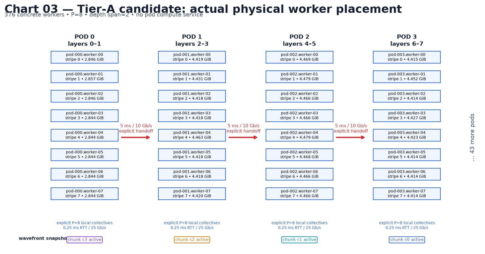

The diagram shows real workers, not an aggregate stage. A pod owns consecutive depth only because its member workers each own the matching stripe across those layers.

## 8. Direct shard-loading audit

The combined physical audit contains **120,159 reads**. Large headline tensors were read through assigned row or strided-column ranges; **0** prohibited large full-tensor materializations were observed. Reviewed whole reads are limited to tensors below 32 MiB and remain charged to an explicit owner.

## 9. Expert-stripe bank design

For P workers, worker p owns intermediate stripe p of all 896 experts. A worker receives one latent activation and ordered top-16 route metadata, evaluates all 16 local fragments, applies route weights locally, accumulates locally, and emits one latent partial. The primary arm therefore exposes P outputs, not 16×P RPCs.

## 10. Expert-stripe physical result

All P=2/4/8/16/32 stripe sweeps reproduced the whole-expert reference within the fixed tolerance. Complete stripe-0 banks physically held all 896 experts at every P and resolved arbitrary routes without weight movement. Best reported expert-stripe relative L2 is 8.983e-08. Route coalescing successfully reduces network-visible outputs to one partial per worker, but physical expert launch coalescing remains 1.0: each row still issues 16 expert calls plus one local reduction.

For chunk 2 at P=8, the worker ceiling is 0.8487 ms versus 2.9001 ms for the whole-expert control and 1.9609 ms after canonical-local broadcast/reduction. The negative-control per-expert networking is 16.2597 ms. Network coalescing works; kernel-launch coalescing does not yet.

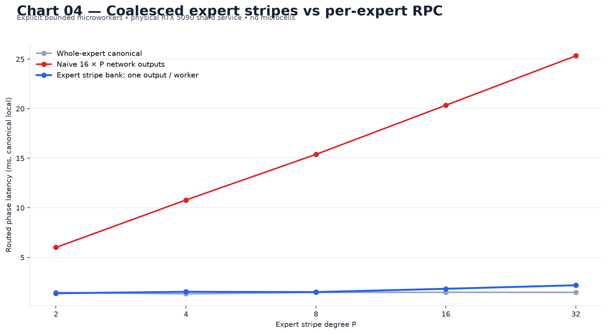

The naive control uses the identical route workload and physical shard compute, but charges 16 network-visible expert outputs per worker. The gap isolates organization, not different routes or weights.

## 11. KDA stripe design/result

Layer 89 was decomposed by head/projection stripe at P=4/8/16/32. The inherited 96-head-only launcher was replaced by a shard launcher that preserves the exact recurrent/conv equations. Representative correctness status is PASS.

## 12. MLA stripe design/result

Layer 91 used head-compatible q/kv/gate slices, local compressed KV state, local absorb/gate, and output-column contributions followed by one reduction. Representative correctness status is PASS.

## 13. Shared expert / LatentMoE result

Latent-down is row-striped and followed by an explicit recursive-doubling all-gather. Expert outputs are reduced once in latent space. Latent-up is column-striped; each worker adds its full-hidden routed partial to its colocated intermediate-striped shared-expert partial before one hidden all-reduce. This removes a separate shared-expert monolith and a redundant layer reduction.

## 14. Endpoint sharding

Embedding and LM-head vocabulary rows are assigned across endpoint workers. Only the embedding owner of a requested token performs the lookup. Every LM-head worker produces its vocabulary-shard logits and one local candidate; a distributed exact max comparison returns the greedy token.

## 15. Sharded-layer correctness

KDA-89 and MLA-91 were executed entirely through shard paths at P=4/8/16/32. Maximum observed representative relative L2 was 3.304e-07; ordered routes remained exact.

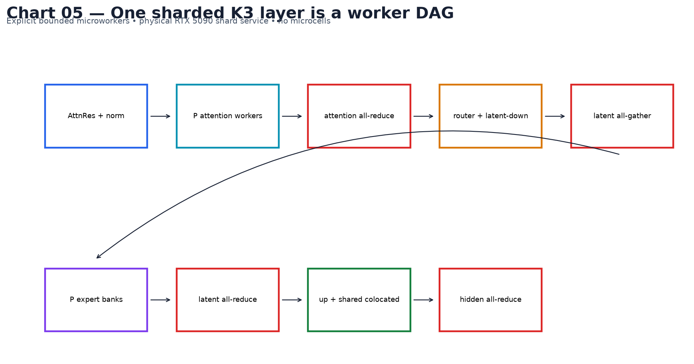

## 16. Multi-layer correctness

The 2/4/8-layer mixed KDA/MLA spans are PASS. Maximum span relative L2 was 1.142e-06.

## 17. Full 93-layer sharded correctness

The complete shard-only traversal is PASS. It executed 93 layers, reported maximum hidden relative L2 1.271e-06, routes_exact=True, and greedy-token match=True.

## 18. Bottom-up timing validation

Held-out median absolute percentage error is 1.15% and p90 is 4.79%. The headline P=8 representative maximum serial reconstruction error is 256.62%; full block-16 reconstruction error is 103.91%. The timing gate is FAIL and normalization_applied=false.

No correction multiplier is applied. Calibration-layer shard services are compared with held-out KDA/MLA layers, and the 93-layer serial reconstruction is compared with the historical exact target curve only after it is calculated.

## 19. Worker-level event model

The winning trace contains **118,932 events**. It schedules explicit exclusive worker queues, directed link queues, recurrent state readiness, recursive-doubling latent all-gathers, binary-tree reductions, and concrete reduction-compute tasks. Total physical compute work is **14608.2 ms**; critical-path compute is **232.5 ms** and critical-path network is **581.5 ms**.

## 20. Wavefront over microworkers

Chunks enter downstream layers as soon as the upstream worker reduction and state dependencies complete. Different pods may process different chunks concurrently, but no worker runs two tasks at once. The result is a scheduled wavefront, never `sum(layer_times)/N`.

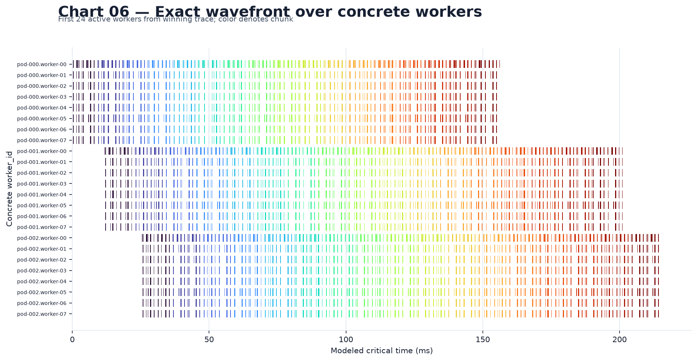

## 21. Worker-memory sweep

| Cap | Best tok/s | Workers | P | Depth | Peak GiB | Block/chunk |
|---|---|---|---|---|---|---|
| 20 GiB | 20.8836 | 376 | 8 | 2 | 4.495 | 16/1 |
| 8 GiB | 20.8836 | 376 | 8 | 2 | 4.495 | 16/1 |
| 4 GiB | 19.8199 | 744 | 8 | 1 | 2.509 | 16/1 |
| 2 GiB | 17.6376 | 1488 | 16 | 1 | 1.261 | 16/1 |
| 1 GiB | 15.6129 | 2976 | 32 | 1 | 0.661 | 16/1 |

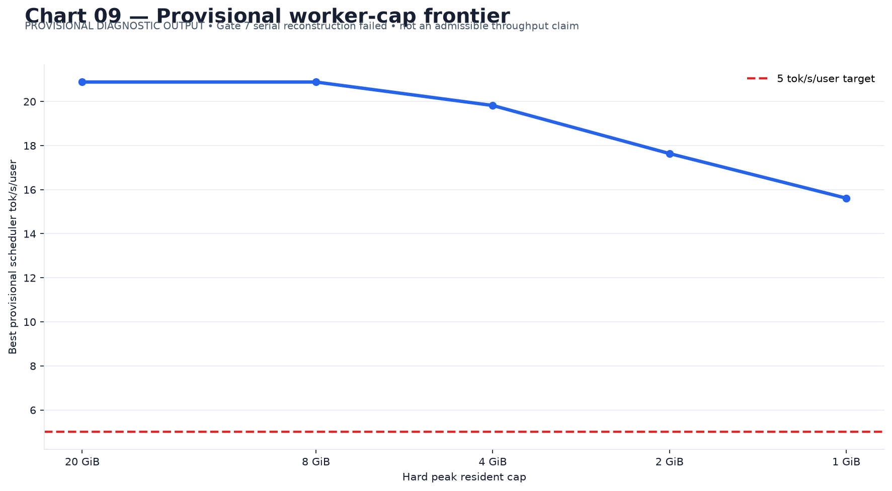

## 22. Worker-count scaling

The winning Tier-A placement reserves **376 workers**; its mean/p50/p95 utilizations are **4.8% / 4.5% / 7.0%**, with **57** workers active simultaneously at peak. Worker count is reported alongside throughput because capacity fan-out is not free.

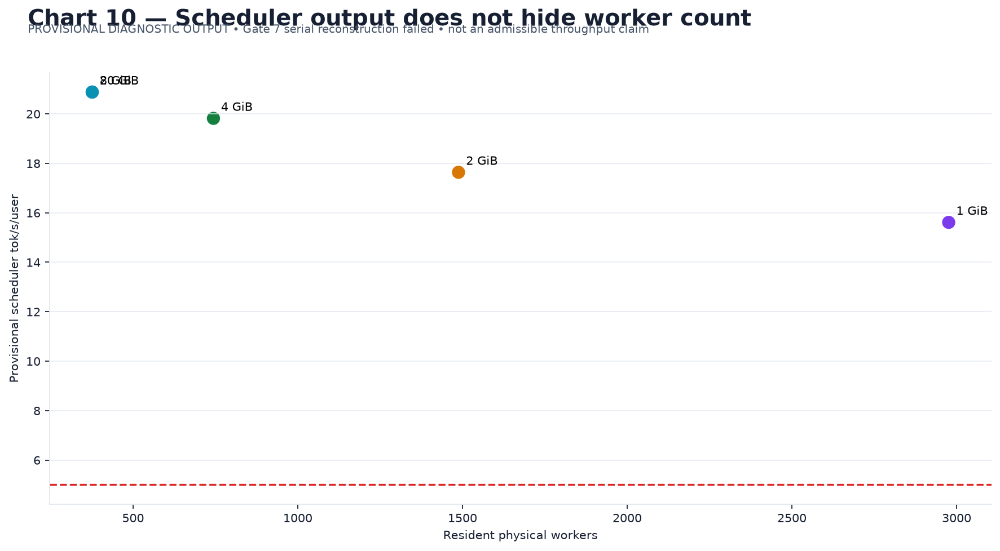

## 23. Network sensitivity

| Local profile | Inter-pod | Strategy | tok/s | Pass 5? |
|---|---|---|---|---|
| very_fast_local | canonical_inter_pod | hybrid | 33.193 | YES |
| very_fast_local | canonical_inter_pod | replicated_small | 33.193 | YES |
| very_fast_local | canonical_inter_pod | hidden_sharded | 31.116 | YES |
| canonical_fast_local | canonical_inter_pod | hybrid | 20.884 | YES |
| canonical_fast_local | canonical_inter_pod | replicated_small | 20.884 | YES |
| canonical_fast_local | canonical_inter_pod | hidden_sharded | 18.671 | YES |
| commodity_fast_lan | canonical_inter_pod | hybrid | 8.855 | YES |
| commodity_fast_lan | canonical_inter_pod | replicated_small | 8.855 | YES |
| commodity_fast_lan | canonical_inter_pod | hidden_sharded | 7.555 | YES |
| regional | regional | hybrid | 2.094 | NO |
| regional | regional | replicated_small | 2.094 | NO |
| regional | regional | hidden_sharded | 1.754 | NO |
| residential_wan | residential_wan | hybrid | 0.492 | NO |
| residential_wan | residential_wan | replicated_small | 0.492 | NO |
| residential_wan | residential_wan | hidden_sharded | 0.417 | NO |

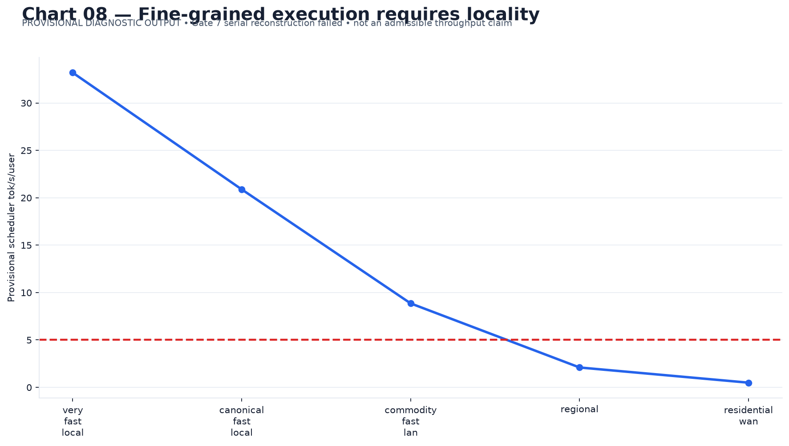

## 24. Heterogeneity/stragglers

| Scenario | tok/s | Target ms | Bottleneck amplification |
|---|---|---|---|
| homogeneous | 20.884 | 814.0 | 1.000× |
| ten_percent_1p5x | 19.598 | 867.4 | 1.066× |
| ten_percent_2x | 18.420 | 922.9 | 1.134× |
| twentyfive_percent_1p5x | 19.087 | 890.7 | 1.094× |
| random_plus_minus_20 | 20.361 | 834.9 | 1.026× |
| network_jitter_plus_minus_20 | 20.548 | 827.3 | 1.016× |

Each layer’s collective completion is governed by the slowest participating worker. The sensitivity receipt reports target-pass amplification explicitly; mean worker speed is never substituted for the maximum.

## 25. Monolith tax

The provisional worker-event target pass minus the E018 coarse target pass is **-1722.43 ms**. Because Gate 7 failed, this signed decomposition is diagnostic only and cannot establish a negative monolith tax. It is retained without clipping so the invalid model remains auditable.

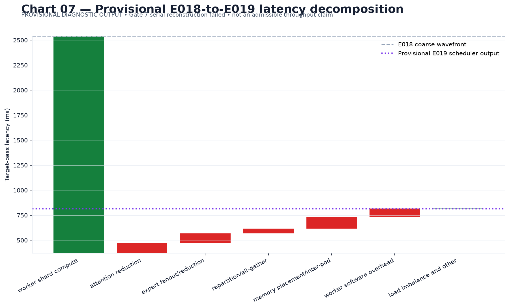

## 26. Final exact oracle

Block 16 / chunk 1 yields a **provisional, inadmissible** 814.04 ms / 20.8836 tok/s/user scheduler output. It is not an exact throughput result because Gate 7 failed. Compute-slowdown sensitivity is reported at 1.0×, 1.5×, 2.0×, 2.5×, and 3.0×; none is labelled RTX 3090.

## 27. Economics/resource efficiency

The provisional candidate reserves **1453.66 GiB** of required model weights across the cluster and schedules **0.8593 active worker-seconds per accepted token**. Network traffic is **141.092 MB per output token**. These are diagnostic resource quantities under an invalid timing model, not a cost claim. Capacity reservation and active compute remain separate columns in the economics receipt.

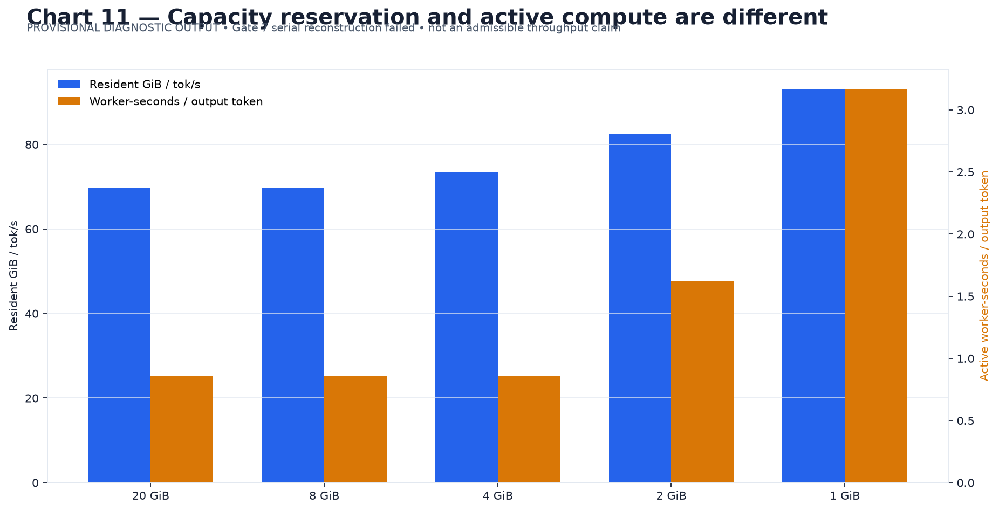

## 28. What failed

- The inherited KDA entry point rejected sub-96-head execution; an Experiment 019 sm_120 shard kernel was required and validated against the canonical equations.
- The first full-oracle loader arm spent minutes in CPU BF16 quantization; exact bit-identical GPU startup conversion replaced it.
- The first layer-0 smoke used an obsolete dense width (18,432); the checkpoint-authoritative 33,792 width exposed and fixed the incomplete execution slice.
- The older non-idot0 oracle differed from the promoted canonical CUDA path by 1.91e-4 at layer 89; the promoted idot0 oracle was selected by repository evidence before final validation.
- The initial full-93 validator compared JSON route lists with oracle tuples, producing a false negative despite identical IDs; all 92 stored route rows were recertified with type-stable comparison and zero mismatches at an unchanged tolerance.
- The initial 8-layer span fixture preloaded the layer-84 AttnRes snapshot before executing layer 84; restricting fixture snapshots to those strictly before the span start made the 2/4/8-layer gates pass without changing execution semantics.
- P=32 exposed a 33,792/32 dense-MLP split that cut native 64-value MXFP4 groups; balanced 64-aligned 17/16-group stripes replaced it and passed physically.
- Bottom-up serial reconstruction missed the block-16 historical target by 103.9%; the P=8 representative layer miss reached 256.6%. Expert stripes still issue 16 logical expert calls per row (coalescing factor 1.0), and measured shard work inflation is 2.304x. No correction factor was applied, so the model is invalid.

## 29. What was retained

The experiment retains exact routing, exact state progression, the E018 chunk wavefront principle, immutable AttnRes transport caching, persistent worker weights/state/buffers, and hierarchical control. It rejects E018 microcells as compute resources and rejects per-expert network RPC as the primary MoE organization.

## 30. What this actually proves about Swarm Inference

The evidence proves byte-exact checkpoint placeability and exact single-device execution of the sub-layer worker graph. It does not establish the throughput thesis because at least one declared validation gate fails.

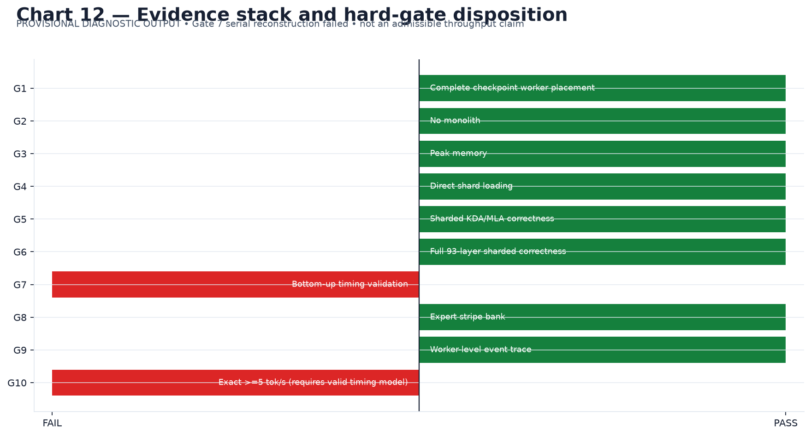

## 31. What remains unproven

No multi-GPU worker pod was physically assembled. Local/inter-pod link performance is shaped by an explicit deterministic model plus measured localhost protocol overhead, not measured on a distributed GPU cluster. RTX 3090 capacity fit is tested by the 20 GiB cap; RTX 3090 throughput is not physically tested. Consumer availability, failure recovery, long-context sustained behavior, and dollar cost of reserved idle capacity remain deployment questions.

## 32. Recommendation for Experiment 020

Physically fuse/coalesce the 16 selected expert fragments on one stripe worker into one or a small number of launches, then remeasure the identical layer-89 route workload and rerun the unchanged serial-reconstruction gate. Expert worker compute is the largest measured serial component. Do not build a distributed pod while the service model remains invalid.

## ARCHITECTURAL SWARM VERDICT

**MODEL INVALID**

This verdict applies only to the bounded-worker architecture model under measured RTX 5090 shard service and shaped links. It is deliberately separate from physical-cluster evidence.

## PHYSICAL SWARM VERDICT

**NOT YET PHYSICALLY PROVEN**

A single RTX 5090 physically executed worker shards sequentially for correctness and service measurement. Multiple independent physical compute devices did not execute the distributed path, so architecture-model evidence must not be described as a measured swarm.
