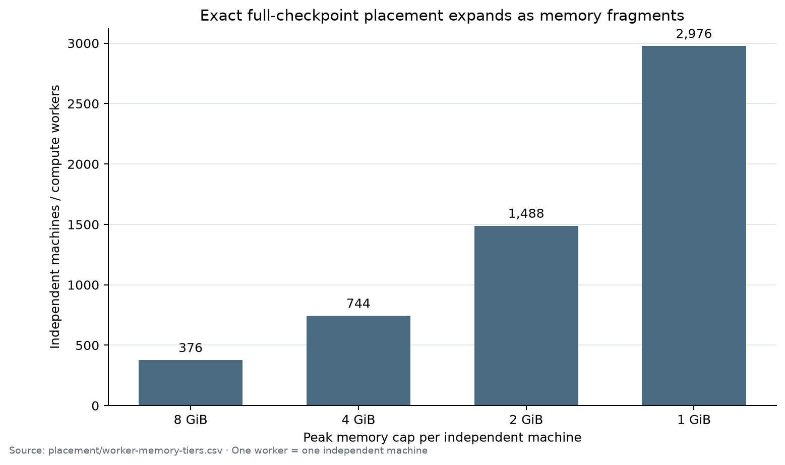
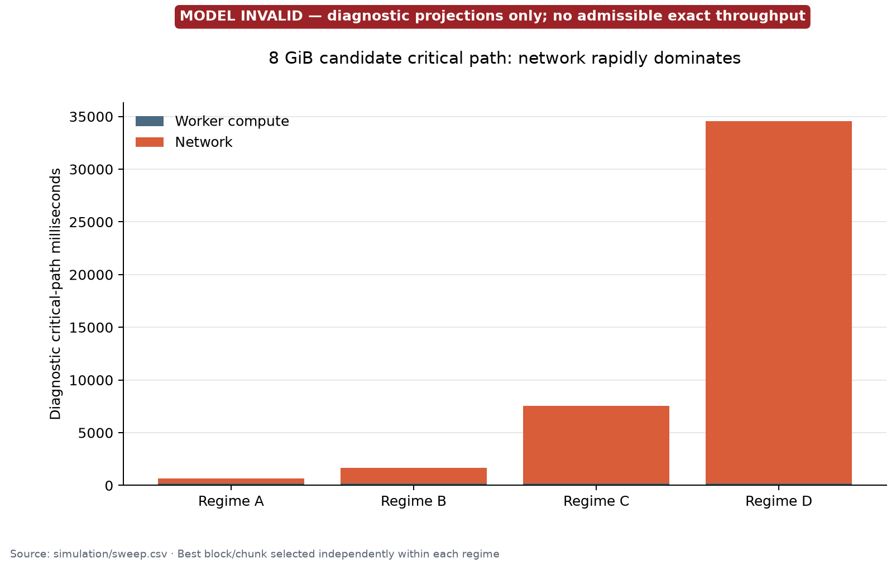
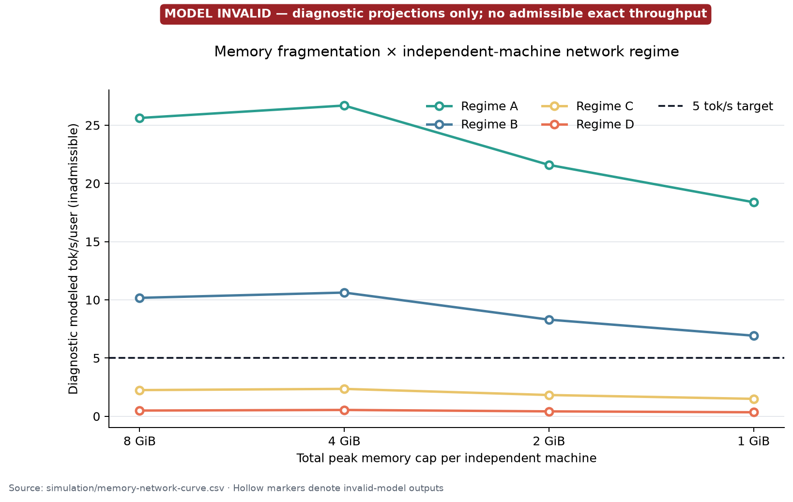
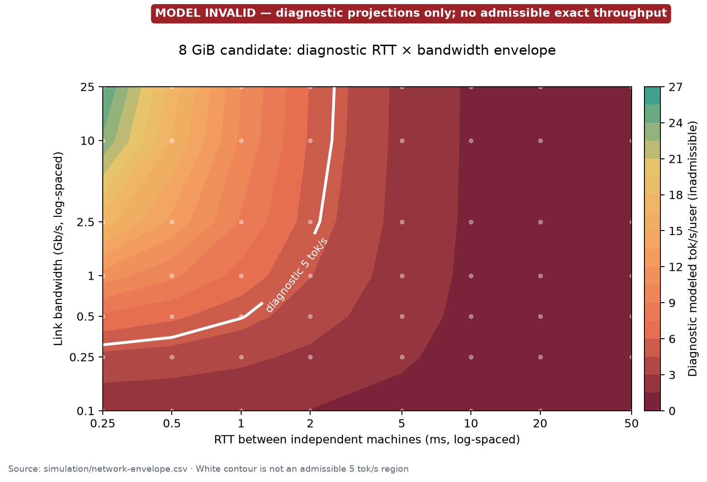
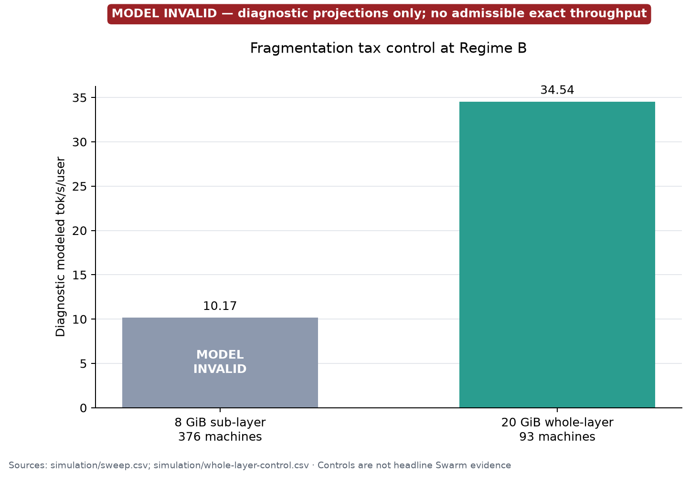
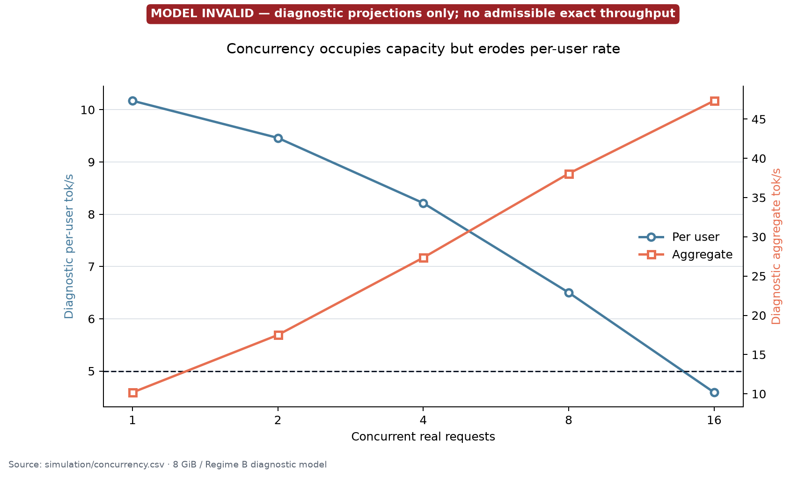
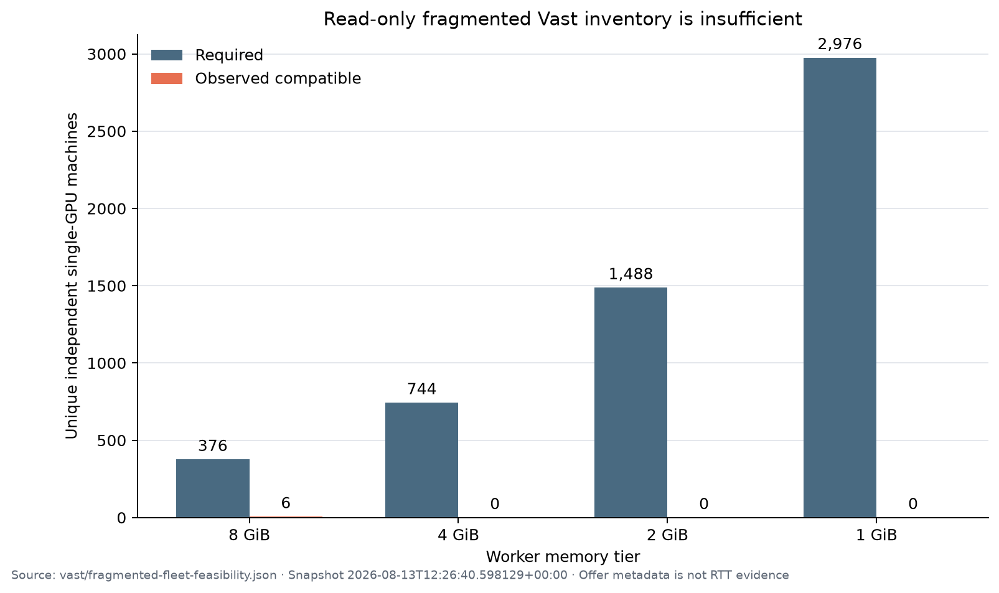
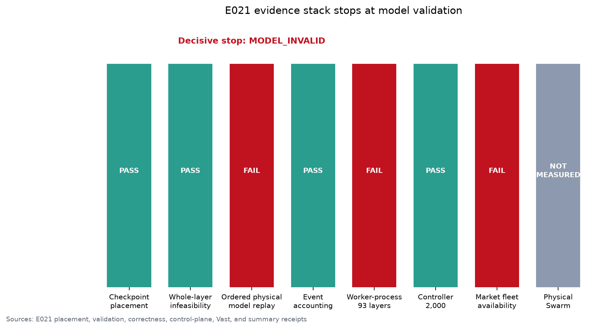

# EXPERIMENT 021: MODEL_INVALID

- Max memory/independent machine: **4.495 GiB peak under the 8 GiB cap**.
- Worker count: **376 independent machines / 376 compute workers**.
- Whole-layer complete-model placement possible: **NO**.
- Best exact tok/s under Regimes A/B/C/D: **N/A / N/A / N/A / N/A — model invalid**.
- Inadmissible diagnostic outputs (not results): A **25.619**, B **10.171**, C **2.250**, D **0.492** tok/s/user.
- Best block/chunk: **no admissible winner**; diagnostic search selected block **16**, chunk **2** at Regime B.
- Model-validation error: **median 95.54% / p90 99.96% / max 99.97%** versus 5%/10%/15% gates.
- Full 93-layer correctness through production worker processes: **FAIL / not executed**.
- Physical independent-machine Swarm measured: **NO**.
- Decisive bottleneck: **the executable shard path is non-resident and production `EXECUTE_SHARD` native dispatch is absent, so the event model does not predict physical runtime**.

This outcome is neither support nor falsification of the sub-layer thesis. The preregistered validation rule requires `MODEL_INVALID`, and it forbids a performance verdict.

## Required truth table

| Question | Answer |
| --- | --- |
| Any GPUs rented in E021? | NO |
| Any Vast resources mutated? | NO |
| Headline max memory per independent machine | 4.495 GiB peak (8 GiB cap) |
| Can complete K3 be executed by assigning whole layers to these machines? | NO |
| Does any headline machine host multiple compute workers? | NO |
| Does any headline worker own a whole ordinary transformer layer? | NO |
| Does any headline worker own a whole routed/shared expert? | NO |
| Full checkpoint covered? | YES |
| Full 93-layer worker-process shard correctness? | FAIL |
| Timing model validated against ordered physical shard execution? | FAIL |
| Headline compute events all tied to explicit workers? | YES |
| Same-host NCCL/NVLink assumed? | NO |
| Best 8 GiB / Regime B tok/s | N/A — MODEL_INVALID |
| Best 8 GiB / Regime C tok/s | N/A — MODEL_INVALID |
| Best 8 GiB / Regime D tok/s | N/A — MODEL_INVALID |
| Best 4 GiB result | N/A — MODEL_INVALID |
| Best 2 GiB result | N/A — MODEL_INVALID |
| Best 1 GiB result | N/A — MODEL_INVALID |
| Physical independent-machine Swarm measured? | NO |

The `N/A` throughput cells are intentional. Values generated by the failed model are shown only in explicitly marked diagnostic figures/tables and never as exact results.

## 1. Executive verdict

E021 succeeds as a falsification of its current performance model. It does **not** validate an independent-machine K3 runtime and it does **not** justify GPU rental. Structural placement is sound, exact math remained numerically correct in the ordered layer-0-to-8 replay, and accounting is conserved, but primitive predictions miss by factors of roughly 2-to-11 and complete-layer/span predictions miss by roughly 2,800x.

The scientific loop was followed: hypothesis → implementation → benchmark → inspection → redesign. The first 2,000-connection controller run failed; bounded-batch connection establishment retained all 2,000 connections and passed on rerun. No corresponding resident-native runtime redesign was completed, so the decisive model gate remains failed without normalization.

## 2. Canonical Swarm definition from AGENTS.md

The repository-root `AGENTS.md` was read completely before experiment work and is authoritative. Its canonical definition is reproduced verbatim:

> **A Swarm result is only a Swarm result if the model cannot be executed by assigning whole layers to the participating workers, and the reported performance emerges from sub-layer fragments distributed across independent machines.**

Every E021 headline identity is one compute worker on one independent machine. Logical depth groups have zero compute and zero memory. There is no free PCIe, NVLink, NCCL, host aggregate, or same-host link class.

## 3. What E018-E020 got right/wrong

E018 contributed the exact wavefront scheduling idea, but its giant 8-layer stages were not worker-sized Swarm resources. E019 contributed full checkpoint sub-layer placement, exact attention decomposition, and expert stripes; its serial-equality model gate was the wrong question. E020 contributed grouped top-16 expert execution, authenticated transport, cache primitives, and deployment scaffolding, but its 12xP8 topology and eight-workers-per-host image are rejected here.

E021 retains the useful shard primitives and wavefront DAG, removes the host/P8 compute abstraction, and subjects the model to contiguous ordered physical replay. That corrected replay exposes a different failure: current executable residency and current service inputs do not describe the same runtime.

## 4. Hard worker definition

- One `machine-XXXX.worker` is one independent machine.
- Every machine hosts exactly one headline compute worker.
- Every resident byte, mutable state, and compute event has a worker owner.
- Every inter-worker dependency uses the same selected independent-machine link profile.
- Depth groups are scheduling labels only; they have no service time or capacity.

## 5. Whole-layer infeasibility proof

The validator censused checkpoint weights plus KDA/MLA state, AttnRes cache, activations, scratch, transport/reduction buffers, CUDA workspace, and allocator overhead for every layer. At 8 GiB only the small layer 0 fits; **92/93 layers do not**. Complete-model whole-layer assignment is therefore impossible. At 4 GiB the same single special layer fits; at 2/1 GiB no layer fits.

- Minimum complete-layer peak: **2.441 GiB**.
- Maximum complete-layer peak: **17.022 GiB**.
- Receipt: [`placement/whole-layer-feasibility.json`](evidence/placement/whole-layer-feasibility.json).

## 6. Memory-tier placements

| Cap | P | Depth | Machines | Max peak | Layer max | Expert max |
| --- | --- | --- | --- | --- | --- | --- |
| 8 GiB | 8 | 2 | 376 | 4.495 GiB | 12.68% | 12.50% |
| 4 GiB | 8 | 1 | 744 | 2.509 GiB | 12.68% | 12.50% |
| 2 GiB | 16 | 1 | 1,488 | 1.271 GiB | 6.45% | 6.25% |
| 1 GiB | 32 | 1 | 2,976 | 0.667 GiB | 3.30% | 3.12% |

Every tier is capacity-valid, but performance is not validated. P=8 has physically measured grouped top-16 service; P=16/P=32 currently fall back to legacy exact expert-stripe service inputs and are especially provisional.

## 7. Complete checkpoint coverage

The E021 census covers **497,220 tensors** and **1,560,860,324,864 bytes**. The byte ledger reports zero gaps and zero unintended overlap. The 8 GiB manifest assigns all checkpoint bytes across 376 independent workers; no worker owns a whole ordinary layer, routed expert, or shared expert.

Direct shard loading passed on **9 representative role reads / 696,418,304 bytes**, with zero large full-tensor materializations. Full coverage is in [`placement/checkpoint-coverage.csv`](../../provenance/source-archive-members.csv); it is deliberately large because it records every tensor owner and byte slice.

## 8. Production worker execution path

Authenticated bounded TLS/HMAC frames, backpressure, explicit worker registration, lifecycle, and cache hash/atomic-marker primitives pass. The ShardCache startup primitive rejects corrupted content and reuses verified objects on restart.

The production path is nevertheless incomplete:

- `EXECUTE_SHARD` in the current worker daemon returns a mock partial vector rather than invoking a native shard primitive.
- Full K3 bundle acquisition is not integrated into the independent worker startup path.
- The only built local Linux image embeds E020's rejected eight-worker host lifecycle, is unpublished, and is not a pinned E021 independent-machine image.

Runtime receipt: [`runtime/production-gates.json`](evidence/runtime/production-gates.json).

## 9. Ordered physical shard validation

The RTX 5090 physically executed layer 0 to establish state, then layers 1-to-8 contiguously. Actual native calls, exact hidden transitions, local authenticated request/result frames, and one-resource/no-overlap order were timed. No target-pass normalization or global multiplier was applied.

| Workload | Predicted ms | Actual ms | APE |
| --- | --- | --- | --- |
| grouped_expert_stripe | 0.1605 | 1.8062 | 91.11% |
| KDA_stripe | 0.2824 | 0.6485 | 56.45% |
| MLA_stripe | 0.2124 | 0.3939 | 46.08% |
| projection_stripe | 0.0468 | 0.0964 | 51.45% |
| shared_expert_stripe | 0.1071 | 0.4357 | 75.42% |
| complete_sharded_KDA_layer | 8.1764 | 22953.2814 | 99.96% |
| complete_sharded_MLA_layer | 7.5657 | 21160.6384 | 99.96% |
| mixed_2_layer_span | 16.3528 | 46762.4973 | 99.97% |
| mixed_4_layer_span | 32.0949 | 90887.4165 | 99.96% |
| mixed_8_layer_span | 64.2386 | 179680.6249 | 99.96% |

The hidden replay remained correct (maximum relative L2 **3.147e-07**), but timing failed. Complete layers took **19.65-23.81 s** while the model predicted millisecond-scale service. The timed graph performed **7,404 direct reads / 14.23 GB** during the span; the event model assumes resident worker banks. Even isolated primitive rows missed by 46-91%, so residency alone is not the only stale assumption.

**Gate result: FAIL → `MODEL_INVALID`.**

## 10. 93-layer correctness

E020's prior in-process physical shard control completed 93 layers, exact routes, and a maximum hidden L2 of **1.194e-06** in about **44.2 minutes**. It used the rejected P8 host-era ownership mapping and did not cross production worker-process dispatch, so it is not admissible for E021 Gate 10.

E021 did not rerun that same in-process shortcut. Production worker-process hidden/logit/token/state receipts remain null. **Gate result: FAIL.**

## 11. Independent-machine event engine

Every diagnostic compute record has `worker_id`; every network record names directed worker-to-worker edges and pays RTT, bandwidth serialization, measured protocol overhead, queueing, and synchronization. Local and inter-depth profile inputs are identical, preventing a hidden intra-host fast path.

Accounting passed across 8/4/2/1 GiB: `sum(worker compute durations)` reconciled to the bottom-up task list, and network duration reconciled to latency + serialization + software overhead. Maximum residuals are floating-point noise; see [`validation/accounting-reconciliation.json`](evidence/validation/accounting-reconciliation.json).

Accounting correctness does not imply timing-model validity. All simulation rows therefore have `admissible=false`.

## 12. Expert stripes

The P=8 diagnostic uses the measured grouped top-16 design: each stripe receives activation, 16 routes and weights, executes local fragments, route-weights and accumulates locally, emits one partial latent vector, and participates in one explicit reduction. It has no per-expert network RPC fanout.

P=16/P=32 lack a physically characterized grouped-bank service and use exact legacy stripe timings only as invalid diagnostics. They cannot support a headline claim.

## 13. KDA/MLA stripes

KDA and Gated MLA are split by explicit head/projection stripes. State objects have worker ownership, AttnRes completed objects are cached at named owners, and required reductions cross independent-machine links. There is no whole-attention-layer service event.

The ordered replay included both complete KDA and complete MLA layers. Their numerical outputs passed; their wall predictions failed.

## 14. Wavefront over independent workers

Blocks 7/12/16 and chunks 1/2/4 were swept. Every stage transition emerges from explicit worker completion. The invalid 8 GiB/Regime B diagnostic selected block 16/chunk 2, with fill **1430.58 ms**, median steady period **30.27 ms**, and drain **1471.31 ms**. These values characterize the failed model, not K3 performance.

## 15. Memory-fragmentation curve

| Cap | A | B | C | D | Workers |
| --- | --- | --- | --- | --- | --- |
| 8 GiB | 25.619* | 10.171* | 2.250* | 0.492* | 376 |
| 4 GiB | 26.688* | 10.625* | 2.353* | 0.544* | 744 |
| 2 GiB | 21.588* | 8.299* | 1.826* | 0.421* | 1,488 |
| 1 GiB | 18.384* | 6.923* | 1.498* | 0.344* | 2,976 |

`*` = diagnostic output from a failed model; no entry is an exact or admissible throughput result.

The invalid model suggests that smaller machines increase worker count, network bytes, active worker-seconds, compute inflation, and idle capacity. At Regime B, diagnostic active worker-seconds/token rise from **0.465** at 8 GiB to **2.457** at 1 GiB; diagnostic network traffic rises from **141.1 MB** to **621.6 MB** per accepted token.

## 16. Network envelope

The 8 GiB diagnostic grid re-schedules the event DAG across RTT 0.25-50 ms and bandwidth 0.1-25 Gb/s. It would cross 5 tok/s only up to about 2 ms RTT at ≥2.5 Gb/s and never at 5 ms on the sampled grid. This is a sensitivity map of an invalid model, not a viable-network claim.

- FAST-LAN SWARM: **NOT SUPPORTED — MODEL_INVALID**
- REGIONAL SWARM: **NOT SUPPORTED — MODEL_INVALID**
- CONSUMER-WAN SWARM: **NOT SUPPORTED — MODEL_INVALID**

## 17. Whole-layer control

The separate relaxed 20 GiB control assigns one complete layer per independent machine (93 machines) and uses E018 physical whole-layer services plus shaped Regime B links. Its best diagnostic value is **34.54 tok/s/user**, versus **10.17** for the invalid 8 GiB sub-layer model. The comparison suggests a large fragmentation tax, but neither number repairs E021 model validation and the whole-layer arm is not a Swarm headline result.

## 18. Control-plane scaling

| Workers | Status | Peak conns | CPU s | RSS MiB | Queue p50 ms |
| --- | --- | --- | --- | --- | --- |
| 100 | PASS | 100 | 0.219 | 99.8 | 13.65 |
| 250 | PASS | 250 | 0.547 | 179.1 | 35.63 |
| 376 | PASS | 376 | 0.859 | 196.1 | 55.51 |
| 500 | PASS | 500 | 1.125 | 241.7 | 73.44 |
| 1,000 | PASS | 1,000 | 2.281 | 402.8 | 166.45 |
| 2,000 | PASS | 2,000 | 4.812 | 747.2 | 393.38 |

The initial unbounded 2,000-connection storm failed. After redesign, the controller established TLS connections in batches of 100, retained all requested connections, then dispatched. The rerun passed with 2,000 peak open connections and 10,000 messages. This measures lightweight lifecycle/protocol scaling only; `native_shard_compute_invoked=false`.

## 19. Heterogeneity

In the invalid 8 GiB/Regime B model, ±20% random compute, 10% at 1.5x/2x slower, ±20% network jitter, and one 2x slow critical-path worker produced diagnostic amplification from **1.000x** to **1.052x**. These small effects indicate modeled network latency, not stragglers, dominates—but this conclusion must be rechecked after runtime validation.

## 20. Concurrency/economics

The invalid model predicts per-user rate falling from **10.17** at one request to **4.59** at 16, while aggregate rate rises to **47.33**. Average utilization remains only **5.85%** at 16 requests.

[`cost/resource-economics.csv`](evidence/cost/resource-economics.csv) reports workers, resident GiB, active/resident worker-seconds, network MB/token, compute inflation, and utilization by tier/regime. It deliberately leaves admissible throughput and cost/token blank. No full compatible market fleet exists, so no legitimate hourly fleet estimate is emitted.

## 21. Read-only fragmented market inventory

The timestamped Vast query searched only rentable single-GPU offers with ≤8 GiB. It found **20 offers**, of which **6 unique machines** met the current SM86/CUDA/driver and 8 GiB placement requirements, versus **376 required**. No smaller tier had a qualifying offer. Offer bandwidth metadata was not used as inter-worker RTT evidence.

The safety receipt records **0 rentals, 0 Vast mutations**, and a blocked mutation self-test before subprocess. Future commands are rendered only in [`vast/rendered-future-plan.txt`](evidence/vast/rendered-future-plan.txt).

## 22. What failed

1. The timing model failed its corrected physical validation by a decisive margin.
2. Physical replay and modeled service do not share a residency policy.
3. Primitive service inputs are stale even before complete-layer load/upload costs.
4. Production worker `EXECUTE_SHARD` native dispatch remains unimplemented.
5. Complete 93-layer worker-process correctness therefore remains untested.
6. The only existing Linux image encodes the rejected E020 host topology and lacks a published immutable digest.
7. Current compatible fragmented market inventory is insufficient.

No gate was moved, no normalization was applied, and no favorable diagnostic projection was promoted.

## 23. What is proven pre-physically

- Exact byte-complete sub-layer placement is possible at 8/4/2/1 GiB caps.
- Complete-model whole-layer assignment is impossible at those caps.
- One-machine/one-worker ownership can be represented without aggregate hosts.
- Ordered physical shard math through layer 8 remains numerically correct.
- The explicit event engine conserves compute/network accounting.
- Authenticated controller protocol can hold 2,000 lightweight workers after bounded connection setup.
- Vast safety remained read-only.

No validated throughput, network envelope, full production correctness, or physical multi-machine claim is proven.

## 24. What remains physically unproven

Independent machines have not executed K3 fragments together. Physical inter-worker RTT/bandwidth, remote collectives, memory peaks on small GPUs, heterogeneous kernels, complete worker startup, and exact 93-layer production transport all remain unmeasured. The evidence class therefore does not reach `VALIDATED_INDEPENDENT_MACHINE_MODEL` or `PHYSICAL_SWARM`.

## 25. Recommendation for the first physical Swarm experiment

**Do not rent yet.** First implement a resident per-worker native runtime whose timed execution matches the event-model residency contract; wire authenticated `EXECUTE_SHARD` to every required native primitive; integrate bundle acquisition and ShardCache at startup; publish a one-worker immutable Linux image; rerun the ordered primitive/layer/2-to-8-layer validation; then complete 93-layer correctness through worker processes.

Only if median/p90/max error passes 5%/10%/15% without normalization and production correctness passes should a later experiment reassess market availability and request explicit rental approval.

## Required hard gates

| Gate | Requirement | Status |
| --- | --- | --- |
| 1 | Root AGENTS.md read and acknowledged | PASS |
| 2 | Zero GPU rentals / zero Vast mutations | PASS |
| 3 | Whole-layer feasibility proves impossible | PASS |
| 4 | Headline cap <=8 GiB | PASS |
| 5 | One worker equals one independent machine | PASS |
| 6 | No whole layer/expert on headline worker | PASS |
| 7 | Full checkpoint byte coverage | PASS |
| 8 | Direct shard loading | PASS |
| 9 | Production EXECUTE_SHARD invokes native code | FAIL |
| 10 | Complete 93-layer worker-process correctness | FAIL |
| 11 | Corrected ordered-shard model validation | FAIL |
| 12 | Event accounting reconciliation | PASS |
| 13 | Every compute event has worker_id | PASS |
| 14 | Every worker dependency has explicit network cost | PASS |
| 15 | No same-host/NCCL/PCIe assumption | PASS |
| 16 | Memory-fragmentation chart produced | PASS_DIAGNOSTIC |
| 17 | Network envelope produced | PASS_DIAGNOSTIC |
| 18 | Whole-layer control separate | PASS_DIAGNOSTIC |
| 19 | Control-plane scale test | PASS |
| 20 | Evidence-class labels correct | PASS |

Because Gates 9-11 fail, E021 issues no Swarm support verdict.

## Before declaring the experiment complete

| Question | Answer |
| --- | --- |
| 1. Could whole-layer assignment execute complete K3? | NO at 8/4/2/1 GiB |
| 2. Does a headline worker aggregate machines/GPUs? | NO |
| 3. Is every compute event tied to a worker? | YES |
| 4. Are total worker memory caps respected? | YES in placement accounting |
| 5. Is the complete checkpoint covered? | YES; 497,220 tensors, zero gap/overlap |
| 6. Are arbitrary real routes supported without hot movement? | PLACED YES; production process NOT PROVEN |
| 7. Are fanout/reduction/network costs explicit? | YES in the diagnostic event DAG |
| 8. Is sharded timing validated? | NO — decisive MODEL_INVALID gate |
| 9. Is the result exact? | Physical replay math YES; no admissible system result |
| 10. Is evidence labeled correctly? | YES; invalid simulations are diagnostics |
| 11. Does the result move the 5 tok/s goal? | NO performance claim; it identifies the blocking runtime mismatch |
| 12. What tier/network is supported? | NONE until model validation passes |

## CORE SWARM PRE-PHYSICAL VERDICT

> Can a Kimi K3 system whose participating independent machines are individually too small to execute the complete model via whole-layer assignment plausibly exceed 5 tok/s using exact sub-layer distributed execution?

**MODEL INVALID.** No memory tier or network regime qualifies. The 8 GiB / Regime B diagnostic projection is not admissible because ordered physical validation failed.

## PHYSICAL SWARM VERDICT

**NOT YET PHYSICALLY PROVEN**
