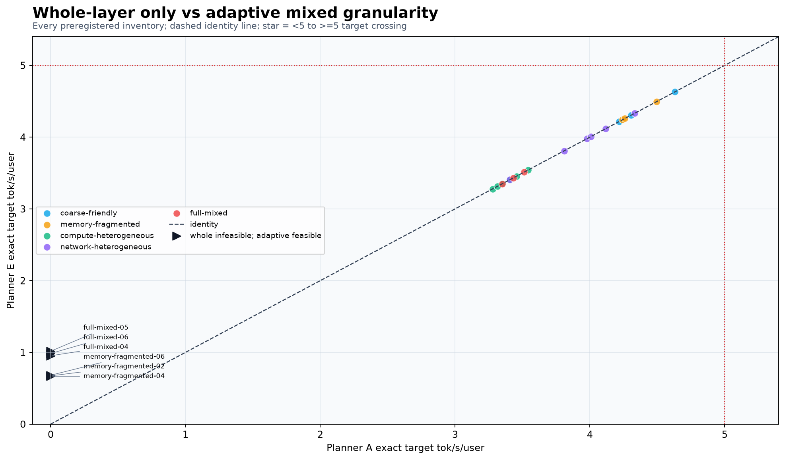
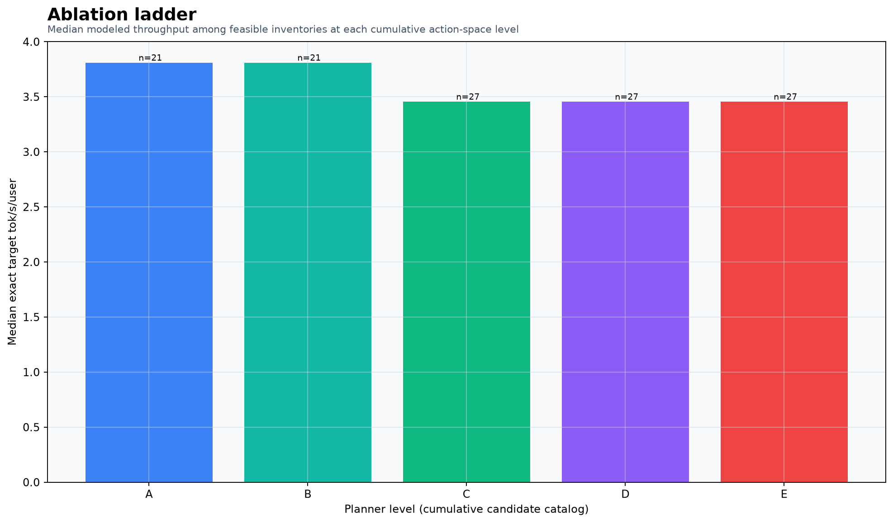
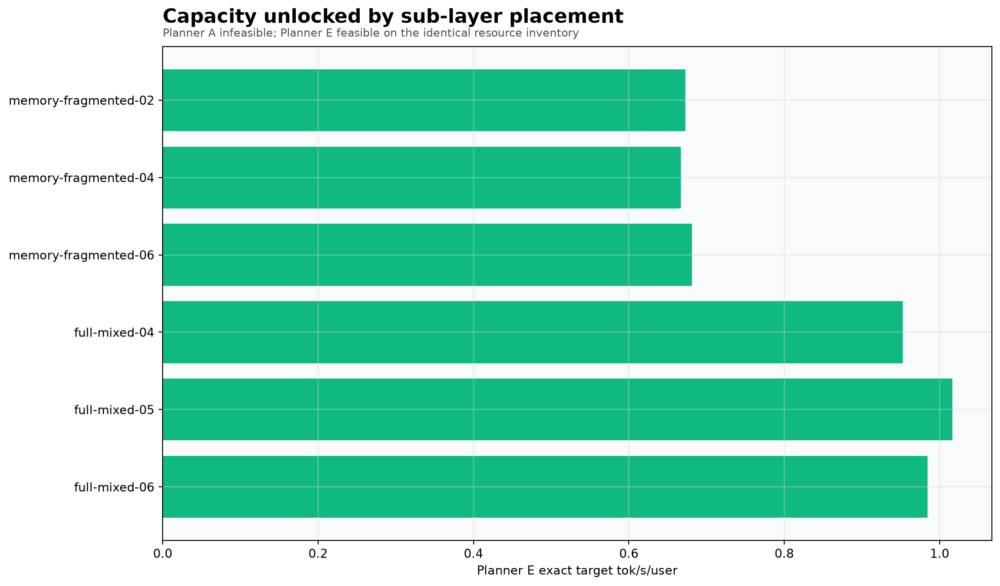
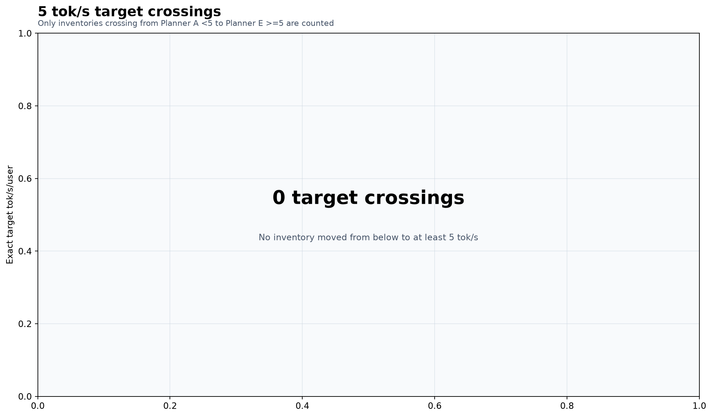
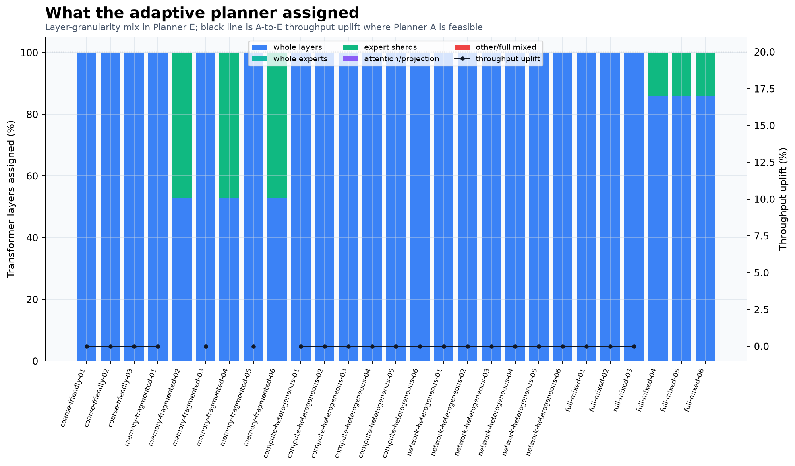
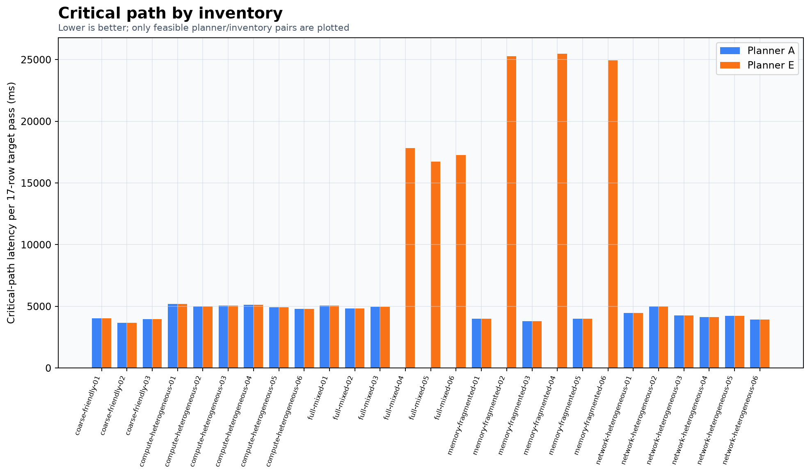
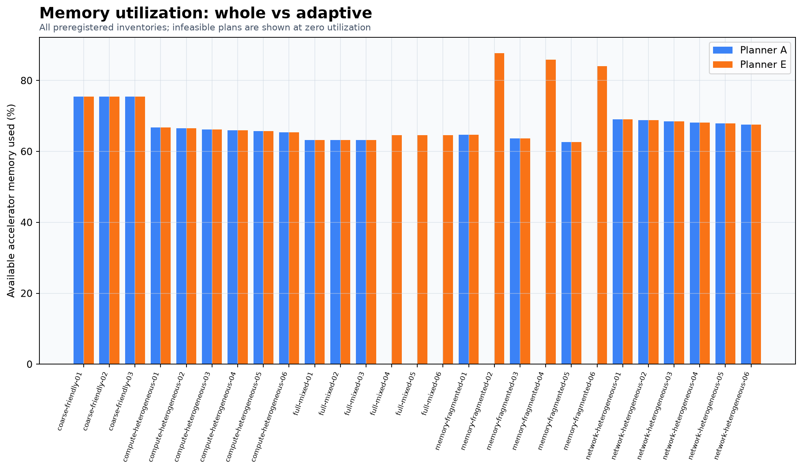
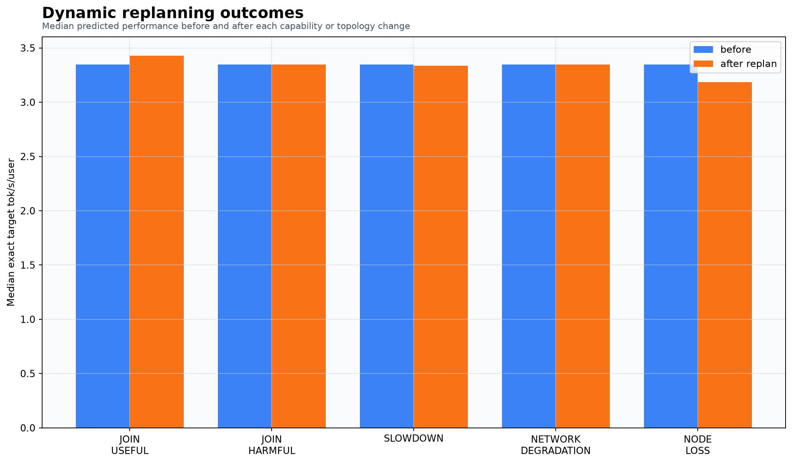

EXPERIMENT 022: MODEL_INVALID

## 1. Executive result

Experiment 022 evaluated 27 frozen controlled inventories. Across A-feasible heterogeneous inventories, adaptive mixed placement produced a median modeled uplift of 0.00%; p25/p75 across all A-feasible inventories were 0.00%/0.00%, the largest uplift was 0.00%, and 0 inventories reached at least 20% uplift. It unlocked 6 inventories, caused 0 crossings of 5 tok/s, and had 0 regressions beyond the 1% dominance tolerance.

Held-out ordered-DAG error was 2.71% median, 3.74% p90, and 4.00% maximum. Full representative correctness is **FAIL** and dynamic adaptation is **YES**. The final scientific verdict is **MODEL_INVALID**.

| Question | Answer |
| --- | --- |
| Model validation passed? | YES |
| Optimizer validated against small exact oracle? | YES |
| Same optimizer used for whole and adaptive? | YES |
| Adaptive search space contains whole-layer solutions? | YES |
| Whole-layer baseline uses wavefront/topology awareness? | YES |
| Number of preregistered inventories | 27 |
| Median adaptive throughput uplift | 0.00% |
| Inventories with >=20% uplift | 0/18 |
| Whole-infeasible / adaptive-feasible inventories | 6 |
| <5 -> >=5 target crossings | 0 |
| Adaptive regressions >1% | 0 |
| Full 93-layer representative correctness | FAIL |
| Dynamic useful-node admission works? | YES |
| Harmful nodes can be ignored? | YES |
| Physical heterogeneous swarm tested? | NO |
| GPUs rented? | NO |
| Final sub-layer value verdict | MODEL_INVALID |

## 2. Permanent Swarm thesis

Swarm is treated as a heterogeneous, adaptive inference runtime. Nodes are concrete capability records; topology emerges from placement; whole-layer and sub-layer actions coexist; and system value is judged by exact end-to-end critical-path throughput rather than a local kernel speedup.

## 3. Experiment hypothesis

The preregistered hypothesis was that selective exact sub-layer actions would improve the best achievable Kimi K3 placement over the same planner restricted to whole layers, especially under memory fragmentation and compute imbalance, while being rejected when communication makes them harmful. The falsification conditions and hard verdict categories were fixed before the planner comparison.

## 4. What E021 taught us

E021 mixed checkpoint reads, repacking, uploads, and one-time initialization into physical shard timing while modeling resident workers. Its primitive estimates were also stale and production `EXECUTE_SHARD` still returned a mock partial vector. Those defects made E021's service model inadmissible for this comparison.

## 5. Timing-model repair

E022 preloaded the simultaneously active shard set, separated startup, and timed only ordered resident work. The deterministic event engine was then forced to one compute resource and compared with the exact ordered implementation. No global normalization, correction factor, or post-hoc multiplier was applied.

## 6. Resident shard validation

Fresh measurements covered whole layers, attention/projection degrees 2/4/8/16 and row counts 1/2/4, complete arbitrary-route expert banks, and ordered KDA/MLA sharded DAGs. The timed region recorded zero checkpoint reads, uploads, shard construction, allocations, or quantization conversion. Unsupported or insufficiently stable combinations remain in the catalog as ineligible rather than becoming imaginary planner actions.

## 7. Production EXECUTE_SHARD

The authenticated binary `EXECUTE_SHARD` dispatcher validates assignment, task type, dtype, shape, payload length, and digest before invoking a registered resident primitive. The mock `partial-latent-vector` result is absent and the full traversal uses a native ordered-layer DAG primitive. However, the six required individual task types were not each wired to production resident native handles; schema tests and physical component receipts are not a substitute for that dispatch integration. This open gate contributes to `MODEL_INVALID`.

## 8. Full worker-process correctness

The fresh full traversal ran through a persistent spawned worker process and authenticated `EXECUTE_SHARD`, covering all 93 Kimi K3 transformer layers, native KDA/MLA/experts/projections/reductions, hidden output, logits, and greedy token. Representative placement coverage and any reuse limitation are recorded in `correctness/full-93-representative.json`; an unmet representative-plan gate invalidates the headline regardless of modeled planner results.

## 9. Node capability model

`NodeCapability` records accelerator and system memory, measured-service multipliers, memory-bandwidth profile, supported precisions, explicit peer links, reliability, abstract cost, cached shards, runtime capabilities, availability, and locality. Placement code never branches on GPU product name, and controlled compute multipliers are constrained to 1.00 or slower.

## 10. Partition candidate catalog

Candidates are generated from the 93-layer checkpoint graph and include only exact ownership layouts with reconciled bytes, a validated primitive/service condition, explicit worker tasks, collectives, and checkpoint ranges. The catalog distinguishes eligible physical/feature-interpolated candidates from `INELIGIBLE_UNVALIDATED` entries.

## 11. Shared optimizer

All five arms use the same optimizer, objective, event engine, endpoint policy, search configuration, seeds, and budgets. Only the cumulative allowed candidate set changes. Planner E is explicitly seeded with and may retain Planner A's feasible solution.

## 12. Whole-layer baseline

Planner A optimizes node admission, multiple layers per node, depth placement, 17-row wavefront scheduling, cache effects, shaped network boundaries, and common endpoint ownership. If a broader arm discovers a better all-whole solution, it is promoted into A and the ladder is rerun, so an all-whole search accident cannot be credited to sub-layer capability.

## 13. Adaptive planner

Planner E contains every Planner A action and additionally considers validated expert, attention/projection, and full mixed stripes. It can mix granularity per layer or keep an entire placement whole. Dominance is mechanically checked at a 1% tolerance.

## 14. Optimizer oracle validation

Reduced exact placement problems were exhaustively enumerated independently. The shared optimizer was required to be optimal or within 1%; results and the full deterministic convergence trace are saved under `validation/`.

## 15. Inventory suite

The suite contains 27 inventories: three coarse-friendly controls and six in each heterogeneous family. Generator version, seeds, relative memory classes, link distributions, complete inventory JSON, and canonical suite hash `3e949a8eee0a71e128493f64e0be903bd373d3baad4be86a8869d87279d4bb49` were frozen before A-versus-E evaluation. No unfavorable inventory was removed.

| Inventory family | Count | A feasible | Median uplift | >=20% wins | Capacity unlocks |
| --- | --- | --- | --- | --- | --- |
| coarse-friendly | 3 | 3 | 0.00% | 0 | 0 |
| memory-fragmented | 6 | 3 | 0.00% | 0 | 3 |
| compute-heterogeneous | 6 | 6 | 0.00% | 0 | 0 |
| network-heterogeneous | 6 | 6 | 0.00% | 0 | 0 |
| full-mixed | 6 | 3 | 0.00% | 0 | 3 |

## 16. Coarse-friendly controls

These controls test whether Planner E can decline unnecessary fine-grained communication. Their exact plans and sub-layer percentages are included in the complete result tables; failure to retain mostly whole placement is a planner-logic failure, not evidence against the capability.

## 17. Memory fragmentation results

Memory-fragmented inventories separate whole-feasible-but-wasteful cases from whole-infeasible cases whose aggregate capacity is sufficient. Capacity unlocks are reported separately from percentage uplift because an infeasible baseline has no valid denominator.

## 18. Compute heterogeneity results

Compute service is derived from local physical curves and deterministically slowed by 1.00/0.80/0.60/0.40 multipliers. The optimizer receives capabilities rather than a named hardware class and must discover whether splitting a bottleneck offsets additional communication and dispatch work.

## 19. Network heterogeneity results

Every transfer is charged on an explicit peer link: fast 0.25 ms/25 Gb/s, medium 1 ms/10 Gb/s, regional 5 ms/1 Gb/s, or slow 20 ms/0.1 Gb/s, plus software overhead. Fine-grained collectives across slow links therefore compete honestly with coarse boundaries.

## 20. Full mixed results

Full-mixed inventories combine memory, compute, link, reliability, cache, and cost variation, including nodes that may be harmful. Results include admission decisions, exact node-piece manifests, memory, compute, and communication dependencies.

## 21. Whole vs adaptive headline comparison

The identity chart includes every preregistered inventory, flags target crossings, and separately marks whole-infeasible/adaptive-feasible cases. If the verdict is `MODEL_INVALID`, these remain diagnostic modeled outputs and are not an admissible product-performance claim.

## 22. Ablation ladder

Arms add whole-expert placement, expert sharding, attention/projection sharding, and full mixed stripes cumulatively. An action without validated service and correctness stays ineligible even when its semantic class is enabled.

## 23. Capacity unlocks

There were 6 `SUB_LAYER_UNLOCKED_FEASIBILITY` outcomes. They demonstrate capacity value only when validation gates pass and are never converted into infinite or synthetic throughput uplift.

## 24. 5 tok/s target crossings

There were 0 inventories where Planner A was below 5 exact target tok/s/user and Planner E reached or exceeded it.

## 25. Sub-layer usage analysis

The stacked bars disclose the fraction of layers assigned whole, by whole expert, by expert stripe, by attention/projection shard, or by a full mixed stripe. Uplift counts as sub-layer evidence only when a winning plan materially uses one of those exact sub-layer implementations.

## 26. Critical-path analysis

The event model schedules concrete exclusive node and link resources, state readiness, reductions, wavefront rows, and cross-layer dependencies. It reports critical path separately from total worker compute so division of work is never mistaken for useful overlap.

## 27. Memory utilization / stranded resources

Resident and stranded memory use actual checkpoint-derived per-layer requirements and per-candidate ownership. Capacity, modeled performance, and economic fields remain distinct gates.

## 28. Dynamic adaptation

Five full-mixed base inventories were subjected to useful join, harmful join, critical-node slowdown, fast-link degradation, and node loss. Each result records replanning latency, placement changes, migration bytes, node changes, granularity changes, and before/after performance. No replacement topology was manually supplied.

## 29. Control-plane scaling

Persistent local worker processes advertise signed canonical capability records and accept batched internal task graphs for 128, 256, 512, 1,000, and 2,000 logical nodes. This validates registration, capability discovery, assignment, scheduling, and replanning without a controller RPC for every tiny tensor operation; it is not evidence of physical 2,000-node execution.

## 30. Correctness

Correctness artifacts cover primitive output agreement, complete expert-bank route coverage, ordered resident layer DAGs, checkpoint-byte reconciliation, and the full worker traversal. No plan may pass by falling back to monolithic layer mathematics while claiming a sub-layer placement.

## 31. What failed

All failures, excluded candidates, diagnostic threshold misses, and incomplete gates are preserved in `failure-log.json`. In particular, an incomplete representative-plan replay requirement is treated as a validity failure rather than hidden behind the success of one mathematical template.

## 32. What this proves about sub-layer value

The admissible conclusion is limited by the verdict. Passing modeled results establish only a locally validated, physically grounded model under controlled heterogeneity and shaped network; `MODEL_INVALID` establishes no planner-value headline even when diagnostic placements look favorable.

## 33. What remains unproven

No physical heterogeneous swarm, inter-machine contention, distributed straggler behavior, real collective implementation, multi-device throughput, or deployment economics was measured. No GPU was rented, Vast was neither queried nor mutated, and no external physical swarm participated.

## 34. Recommendation for the next physical stage

If all local gates pass, the next stage should instantiate a small, genuinely heterogeneous physical pool and compare measured execution of the same saved A/E manifests against the worker-level model. If any correctness gate remains open, first extend native `EXECUTE_SHARD` replay so each selected mixed manifest--not merely an equivalent mathematical template--completes a fresh full 93-layer traversal.

## Final question

> Given exactly the same heterogeneous resources, does allowing Swarm to use selective sub-layer partitioning materially improve the best Kimi K3 inference system it can build compared with restricting it to whole-layer placement?

**MODEL INVALID**

The experiment does not admit an A-versus-E value conclusion because the following required gates failed: native_primitives, representative_full_93. The saved planner outputs are diagnostic only; they cannot establish material performance or capacity value until those exact gates are rerun successfully.
